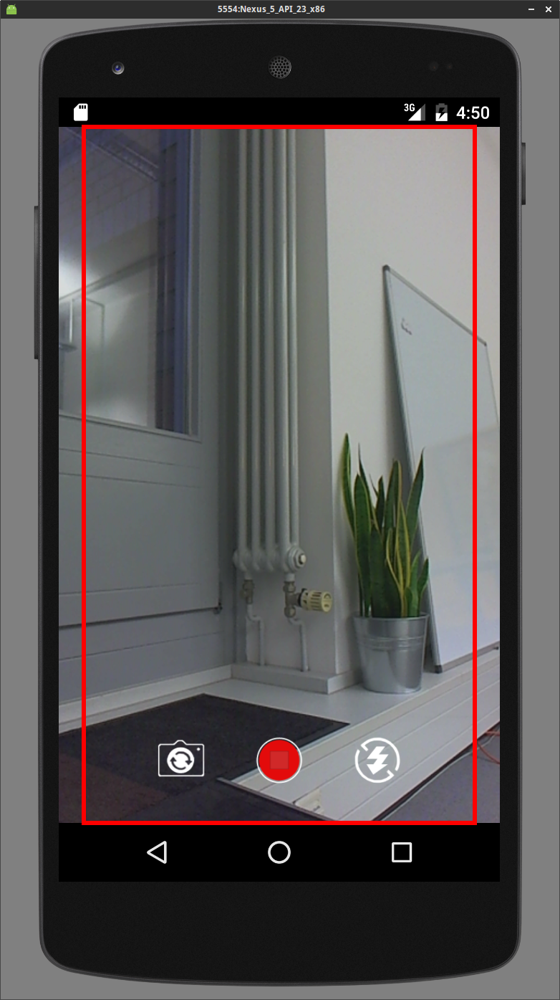
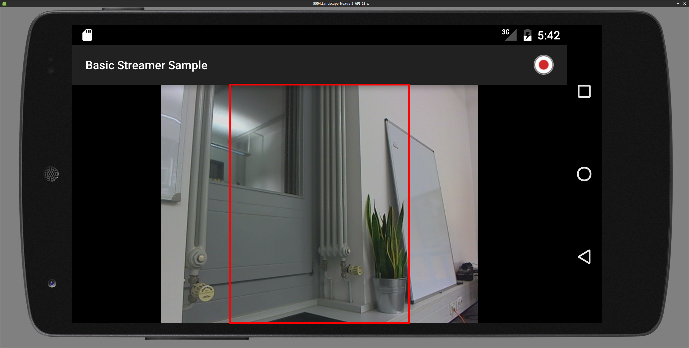
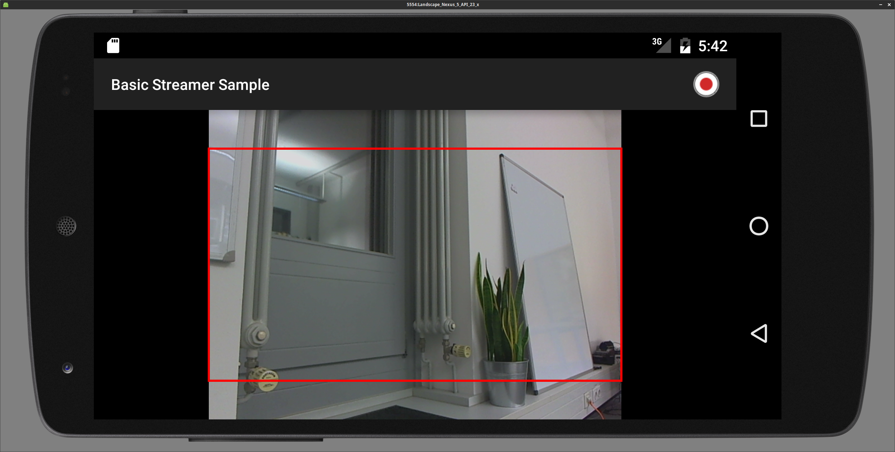
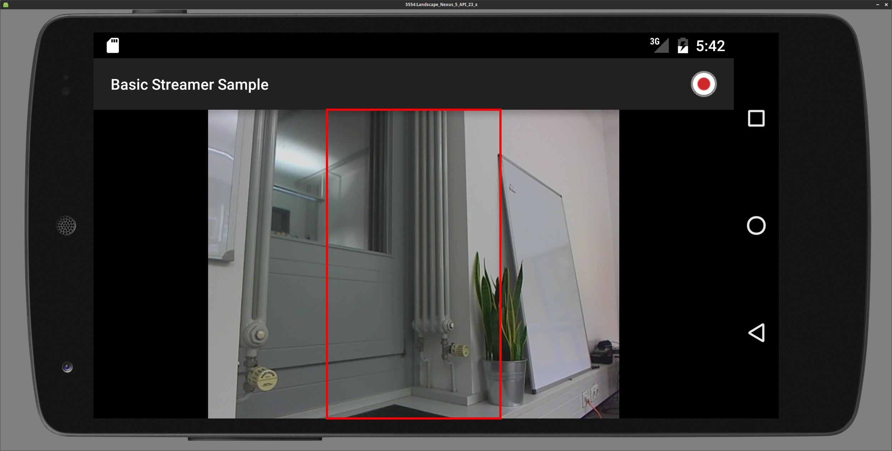

Advanced Settings/Usage
=======================

Resolution, Aspect Ratio and Orientation
----------------------------------------

### Resolution

Resolution means the native resolution of the camera (input). In the most situations this will be the same for the output. To set the resolution there is a function in the `VideoSettings` object called `setResolution(Resolution res)`. If you set a resolution that the device doesn't support, nanoStream will automatically switch to the nearest resolution available on the device. A list of supported resolutions for the current video source can be obtained from `getCapabilities().listAvailableVideoResolutions()` on the `nanoStream` object.

### Aspect Ratio

Aspect ratio means the aspect ratio of the outgoing stream. The aspect ratio determines if the input video needs to be cropped. The aspect ratio can be set through the `setAspectRatio(AspectRatio aspectRatio)` function on the `VideoSettings` object.

#### Supported Aspect Ratios

| Aspect Ratio | AspectRatio value            |
|--------------|------------------------------|
| Keep Input   | AspectRatio.RATIO_KEEP_INPUT |
| 1:1          | AspectRatio.RATIO_1_1        |
| 4:3          | AspectRatio.RATIO_4_3        |
| 16:9         | AspectRatio.RATIO_16_9       |
| 3:4          | AspectRatio.RATIO_3_4        |
| 9:16         | AspectRatio.RATIO_9_16       |

### Orientation

The default stream orientation is landscape. If you switch to portrait the resolution will swap width and height, e.g. from 640x480 to 480x640. You can set the stream orientation on the `nanoStream` object with the `setStreamRotation` function. The stream orientation needs to be set before starting the stream, it is not possible to switch the orientation during the stream.

#### Supported Orientations

| Orientation           | Rotation Value        |
|-----------------------|-----------------------|
| Landscape             | Rotation.ROTATION_0   |
| Portrait              | Rotation.ROTATION_90  |
| Landscape Upside Down | Rotation.ROTATION_180 |
| Portrait Upside Down  | Rotation.ROTATION_270 |

### Example Combinations of Aspect Ratios and Orientations

The input resolution is set to 640x480 here. The red rectangle marks up the active area that is included in the output stream.

| Orientation                    | Aspect Ratio | Stream Area                                 |
|--------------------------------|--------------|---------------------------------------------|
| Portrait<sup>[1](#fnAS1)</sup> | Keep Input   |   |
| Portrait<sup>[1](#fnAS1)</sup> | 4:3          |          |
| Portrait<sup>[1](#fnAS1)</sup> | 3:4          |          |
| Portrait<sup>[1](#fnAS1)</sup> | 16:9         |         |
| Portrait<sup>[1](#fnAS1)</sup> | 9:16         |         |
| Landscape                      | Keep Input   |  |
| Landscape                      | 4:3          |         |
| Landscape                      | 3:4          |         |
| Landscape                      | 16:9         |        |
| Landscape                      | 9:16         |        |

<a name="fnAS1">1</a>: In this sample APP we crop the preview so it doesn't look ugly, so the stream is actually larger then the preview.

### Example

If you want to stream with a resolution of 640x360 but your device doesn't supports this resolution, you need to crop the resolution from 640x480 (this resolution is supported by the most devices) to 640x360. This can be done through the aspect ratio, so you need to set the aspect ratio to 16:9 to stream with a resolution of 640x360.

### Implementation Example

```java
public class MainActifity {
    ...
    @Override
    protected void onCreate(Bundle savedInstanceState) {
      super.onCreate(savedInstanceState);
      nanoStreamSettings nss = new nanoStreamSettings();
      VideoSettings vs = new VideoSettings();
      ...
      vs.setResolution(new Resolution(640, 480)); // default value
      vs.setAspectRatio(AspectRatio.RATIO_16_9); // default value is AspectRatio.KEEP_INPUT
      ...
      streamLib = new nanoStream(nss);
      streaLib.init();

      streamLib.setStreamRotation(Rotation.ROTATION_0); // default value
      ...
    }
    ...
}
```

RotationHelper
--------------

### Description

With the nanoStream SDK 4.3.1 release we added a 'RotationHelper' Class, this Class improves the Rotation handling. The RotationHelper class has two static Methods, 'getDeviceDefaultOrientation(Context context)' and 'getRotation(int orientation, boolean isDefaultOrientationLandscape)'.

### getDeviceDefaultOrientation

The return values are one of the following:

-	[Configuration.ORIENTATION_LANDSCAPE][4c50db80]
-	[Configuration.ORIENTATION_PORTRAIT][4ec624ac]

### getRotation

#### Parameter

The 'orientation' parameter of the 'getRoation' Method is one of the following:

-	[ActivityInfo.SCREEN_ORIENTATION_PORTRAIT][baf72420]
-	[ActivityInfo.SCREEN_ORIENTATION_LANDSCAPE][c47724c3]
-	[ActivityInfo.SCREEN_ORIENTATION_REVERSE_PORTRAIT][a59fc893]
-	[ActivityInfo.SCREEN_ORIENTATION_REVERSE_LANDSCAPE][b1a7076f]

The 'isDefaultOrientationLandscape' parameter is true or false.

#### Return Values

The return values given from 'RotationHelper.getRoation' can be used as a Parameter for 'setStreamRotation' and 'setPreviewRotation'. is the 'orientation' parameter non of the above described the 'getRotation' Method returns 'null'.

### Implementation Example

```java
import net.nanocosmos.nanoStream.streamer.Rotation;
import net.nanocosmos.nanoStream.streamer.RotationHelper;

public class MainActivity extends Activity {
  // ...
  private boolean isDefaultOrientationLandscape = false;
  private CustomOrientationEventListener orientation = null;

  @Override
  protected void onCreate(Bundle savedInstanceState) {
    super.onCreate(savedInstanceState);
    // ...
    streamLib = new nanoStream(/*settings*/);

    isDefaultOrientationLandscape = (RotationHelper.getDeviceDefaultOrientation(this) == android.content.res.Configuration.ORIENTATION_LANDSCAPE);
    orientation = new CustomOrientationEventListener(this, SensorManager.SENSOR_DELAY_UI);
    orientation.enable();
  }

  private class CustomOrientationEventListener extends OrientationEventListener {
    private int lastScreenOrientation = 0;
    public CustomOrientationEventListener(Context context, int rate) {
      super(context, rate);
    }

    @Override
    public void onOrientationChanged(int orientation) {
      if (null != streamLib) {
        if(!streamLib.hasState(nanoStream.EncoderState.RUNNING)) {
          if (isDefaultOrientationLandscape) {
              orientation -= 90;

              if (orientation < 0) {
                  orientation += 360;
              }
          }
          int screenOrientation = -1;

          if (orientation > 70 && orientation < 110) {
            setRequestedOrientation(ActivityInfo.SCREEN_ORIENTATION_REVERSE_LANDSCAPE);
            screenOrientation = ActivityInfo.SCREEN_ORIENTATION_REVERSE_LANDSCAPE;
          } else if (orientation > 160 && orientation < 200) {
            setRequestedOrientation(ActivityInfo.SCREEN_ORIENTATION_REVERSE_PORTRAIT);
            screenOrientation = ActivityInfo.SCREEN_ORIENTATION_REVERSE_PORTRAIT;
          } else if (orientation > 250 && orientation < 290) {
            setRequestedOrientation(ActivityInfo.SCREEN_ORIENTATION_LANDSCAPE);
            screenOrientation = ActivityInfo.SCREEN_ORIENTATION_LANDSCAPE;
          } else if ((orientation > 340 && orientation <= 360) || (orientation >= 0 && orientation < 20)) {
            setRequestedOrientation(ActivityInfo.SCREEN_ORIENTATION_PORTRAIT);
            screenOrientation = ActivityInfo.SCREEN_ORIENTATION_PORTRAIT;
          }

          if (screenOrientation != lastScreenOrientation) {
            Rotation rotation = RotationHelper.getRotation(screenOrientation, isDefaultOrientationLandscape);
            if (null != rotation) {
              try {
                streamLib.setPreviewRotation(rotation);
                streamLib.setStreamRotation(rotation);
                streamLib.setAspectRatio(videoAspectRatio);
              } catch (IllegalStateException e) {
                Logging.log(Logging.LogLevel.ERROR, TAG, "Camera rotate failed", e);
              }
            }
            lastScreenOrientation = screenOrientation;
          }
        }
      }
    }
  }
}
```

Stream Type
-----------

The SDK supports differnet streaming modes:

-	Video and Audio
-	Video only
-	Audio only

You can en/disable Video/Audio in the `nanoStreamSettings`.

### Implementation Example

```java
nanoStreamSettings nss = new nanoStreamSettings();
nss.setHaveVideo(true); // false
nss.setHaveAudio(true); // false
```

Local Recording
---------------

### Description

The nanoStream Android SDK supports local file recording on the device in MP4 format. This document describes how to enable and configure nanoStream for local recording.

### Steps to configure MP4 recording

MP4 recording can be configured with two function calls on a nanoStreamSettings object.

-	Enabling MP4 recording: setRecordMp4(boolean)
-	Setting up the file path: setMp4Path(String)

### setRecordMp4(boolean)

The setRecordMp4 function takes a boolean as parameter to enable/disable the recording function.

### setMp4Path(String)

The setMp4Path function takes a String as parameter. This string needs to be a valid file path (e.g. /sdcard/test.mp4).
It is recommended to use the getExternalStorageDirectory or getExternalStoragePublicDirectory functions from the
[Android Enviroment][8928e181] API, and add a file name to the returned path. Please find the code snippet below as an example.

### Android Permission

To be able to write to an external file path your Android app needs the following permissions to be added to the app manifest (AndroidMainfest.xml).

```xml
<uses-permission android:name="android.permission.WRITE_EXTERNAL_STORAGE" />
<uses-permission android:name="android.permission.STORAGE" />
```

#### Android 6.0

Due to the new permission handling in Android 6 (M) writing to external directories (DCIM) requires a permission by user. Writing to the applications own data directory (/Android/data/com.companyname.appname/) is not restricted.

### Implementation Example

```java
File externalFilePath = Environment.getExternalStoragePublicDirectory(Environment.DIRECTORY_DCIM);
File filePath = new File(externalFilePath, "myMp4File.mp4");
String mp4FilePath = filePath.getAbsolutePath();

nanoStreamSettings nss = new nanoStreamSettings();
nss.setRecordMp4(true);
nss.setMp4Path(mp4FilePath);
```

Adaptive Bitrate Streaming
--------------------------

By using the Adaptive Bitrate Control (ABC) the stream will automatically adjust to changes of the bandwidth. There are four modes available:

-	DISABLED: The Adaptive Bitrate Control is disabled.
-	QUALITY_DEGRADE: The video quality will be changed if the bandwidth changes. For instance, if not enough bandwidth is available, the video bitrate will be decreased, which in turn degrades the video quality.
-	FRAME_DROP: Low bandwidth is compensated by decreasing the framerate (FPS), but maintaining the video qualtiy.
-	QUALITY_DEGRADE_AND_FRAME_DROP: The video quality and the framerate (FPS) decreased if the not enough bandwidth is available.

Make sure to set the ABC settings before a stream is started.

### Implementation Example

```java
private AdaptiveBitrateControlSettings.AdaptiveBitrateControlMode abcMode = AdaptiveBitrateControlSettings.AdaptiveBitrateControlMode.QUALITY_DEGRADE_AND_FRAME_DROP;
private int videoBitrate = 500000;

private void initStreamLib() {
  AdaptiveBitrateControlSettings abcSettings = new AdaptiveBitrateControlSettings(abcMode);
  abcSettings.SetMaximumBitrate((int)(videoBitrate * 1.5));

  nanoStreamSettings nss = new nanoStreamSettings();
  nss.setAbcSettings(abcSettings);
}
```

Measuring the available bandwidth
---------------------------------

For measuring the available bandwidth you can use the method `runBandwidthCheck`. After the check finished, the result can be used to set the bitrate for the nanoStream object.
The check measures the bandwidth by running a test stream to the server.

The BandwidthCheck Class has three public functions:

-	runBandwidthCheck(BandwidthCheckSettings settings, BandwidthCheckResultCallback callback()
-	forceStop()
-	abort()

There is a BandwidthCheckSettings Class, the constructor creates a standard object of BandwidthCheckSettings, with the following settings:

| property       | default values             | meaning                                            |
|----------------|----------------------------|----------------------------------------------------|
| prerollSeconds | 1 (in sec.)                | this is the pre roll time to connect to the server |
| runTime        | 5 (in sec.)                | the run time of the bandwidth check                |
| maxBitrate     | 3000000 (bit/s = 3 MBit/s) | the maximum bit rate for the bandwidth check       |
| rtmpUrl        | empty                      | the rtmp url for the bandwidth check               |
| streamId       | empty                      | the stream id for the bandwidth check              |

With this settings you can call the runBandwidthCheck methode, the second parameter is the callback for the results. This callback class has a finished method that will be called after bandwidth check is done.
The finished method has one parameter from type BandwidthCheckResult, this object has 6 getter methods:

 - getAverageBitrate() // the average measured bandwidth
 - getMedianBitrate() // the median measured bandwidth
 - getMaxBitrate() // the maximum measured bandwidth
 - getMinBitrate() // the minimum measured bandwidth
 - getRunTimeMS() // the run time in ms
 - getErrorCode() // the error code if all is ok this is nanoResults.N_OK (all error codes can be found in the nanoStream API Reference documentation for nanoResults)

The forceStop call stops the bandwidth check and will return the results that where measured until then. The abort call stops the bandwidth check but don't return any results.

The bandwidth check, sends a special type of metadata that will not be recorded on the Streaming Server.

### Implementation Example

```java
private BandwidthCheck bwCheck = null;

private class CustomBandwidthCheckResultCallback implements BandwidthCheckResultCallback {
  @Override
  public void finished(final BandwidthCheckResult bandwidthCheckResult) {
    Log.d(TAG, "BandwidthCheck results: " +
      "\n\tAverage Bitrate (kBit/s): " + bandwidthCheckResult.getAverageBitrate() / 1000 +
      "\n\tMedian Bitrate  (kBit/s): " + bandwidthCheckResult.getMedianBitrate() / 1000 +
      "\n\tMax Bitrate     (kBit/s): " + bandwidthCheckResult.getMaxBitrate() / 1000 +
      "\n\tMin Bitrate     (kBit/s): " + bandwidthCheckResult.getMinBitrate() / 1000 +
      "\n\tRun Time        (ms)    : " + bandwidthCheckResult.getRunTimeMS());
  }
}

private void initBandwidthCheck() {
  if(null == bwCheck) {
    BandwidthCheckSettings settings = new BandwidthCheckSettings();
    settings.setRtmpUrl(serverUrl);
    settings.setStreamId(streamName);
    bwCheck = new BandwidthCheck();
    bwCheck.runBandwidthCheck(settings, new CustomBandwidthCheckResultCallback());
  }
}
```

RTMP Quality Statistics
-----------------------

### Description

The RTMP Module provides the current RTMP Quality over the 'NanostreamEventListener'. These includes the 'output bit rate', 'buffer fullness', 'bit rate' and 'frame rate'.

### Implementation Example

```java
public class MainActivity extends Activity implements NanostreamEventListener {
  private LinearLayout qualityView = null;
	private TextView outputBitrate = null;
	private TextView bufferFullness = null;
	private TextView bitrate = null;
	private TextView framerate = null;

  @Override
  protected void onCreate(Bundle savedInstanceState) {
    qualityView = (LinearLayout) findViewById(R.id.qualityView);
		outputBitrate = (TextView) findViewById(R.id.outputBitrateText);
		bufferFullness = (TextView) findViewById(R.id.bufferfillnessText);
		bitrate = (TextView) findViewById(R.id.bitrateText);
		framerate = (TextView) findViewById(R.id.framerateText);

    // Init nanoStream    
  }

  @Override
	public void onNanostreamEvent(NanostreamEvent event)
	{
		if (event.GetType() == NanostreamEvent.TYPE_RTMP_QUALITY)
		{
			this.runOnUiThread(new ViewQualityRunnable(event));
		}
	}

  private class ViewQualityRunnable implements Runnable
	{
		private NanostreamEvent m_event;
		private DecimalFormat format;

		public ViewQualityRunnable(NanostreamEvent m_event)
		{
			super();
			this.m_event = m_event;
			format = new DecimalFormat("#0.00");
		}

		@Override
		public void run()
		{
			if (qualityView.getAlpha() == 0 && m_event.GetParam1() != 0 && m_event.GetParam2() != 0 && m_event.GetParam3() != 0 && m_event.GetParam4() != 0)
			{
				qualityView.setAlpha(0.5f);
			}
			int qualityColor = Color.YELLOW;
			if (m_event.GetParam2() >= 1000)
			{
				qualityColor = Color.rgb(255, 0, 0);
			} else if (m_event.GetParam2() >= 750)
			{
				qualityColor = Color.YELLOW;
			} else if (m_event.GetParam2() <= 750)
			{
				qualityColor = Color.GREEN;
			}

			outputBitrate.setText(Long.toString(m_event.GetParam1() / 1000) + "kbit/s");
			outputBitrate.setTextColor(qualityColor);
			bufferFullness.setText(format.format(((double) m_event.GetParam2() / 100.0)) + "%");
			bufferFullness.setTextColor(qualityColor);
			bitrate.setText(Long.toString(m_event.GetParam3() / 1000) + "kbit/s");
			framerate.setText(m_event.GetParam4() + "fps");

		}
	}
}
```

Camera Zoom
-----------

### Description

The nanoStream Android SDK supports camera zoom, if the internal camera supports it. Therefor there are a few functions, the most important are:

| Function          | Return Type     | returns                                                                   |
|-------------------|-----------------|---------------------------------------------------------------------------|
| `hasZoom()`       | `booelan`       | true if zoom is supported by the video source / device                    |
| `getZoomRatios()` | `List<Integer>` | list with of ale zoom ratios                                              |
| `getZoom()`       | `int`           | the index of the `List<Integer>` that returned from `getZommRatios()`     |
| `setZoom(int)`    | `int`           | the new index of the `List<Integer>` that returned from `getZommRatios()` |

It is recommended to use `pinch to zoom`, therefor you need to implement a `ScaleGestureDetector.SimpleOnScaleGestureListener`, and a `pinch2zoom` function, that takes the `scalefactor` from the `SimpleOnScaleGestureListener` as a int parameter, take a look at the [Implementation Example](#implementation_example_7).

### getZoomRatios()

`getZoomRatios()` returns a List of Integer values, this values are the zoom ratios in 1/100 increments (e.g. a zoom of 3.2x is returned as 320).

### setZoom(int)

The int parameter from `setZoom(int zoom)` is the index of zoom ratios that returns `getZoomRatios()`.

### Zoom Behavior on Camera Switch

During a camera switch (e.g. from back to front) the zoom remains unaffected.

### Implementation Example

```java
public class MainActivity extends Activity {
  private ScaleGestureDetector scaleGestureDetector;
  private List<Integer> mZoomRatios = null;

  private nanoStream streamLib = null;

  @Override
  protected void onCreate(Bundle savedInstanceState) {
    super.onCreate(savedInstanceState);

    nanoStreamSettings nss = new nanoStreamSettings();
    // configure nanoStreamSettings

    streamLib = new nanoStream(nss);

    if(streamLib.hasZoom()) {
      mZoomRatios = streamLib.getZoomRatio();
    }

    if(null == scaleGestureDetector) {
      scaleGestureDetector = new ScaleGestureDetector(this, new ScaleGestureListener());
    }
  }

  @Override
  public boolean onTouchEvent(MotionEvent event)
  {
    if (scaleGestureDetector != null)
    {
      scaleGestureDetector.onTouchEvent(event);
    }
    return true;
  }

  private class ScaleGestureListener extends ScaleGestureDetector.SimpleOnScaleGestureListener {
    @Override
    public boolean onScale(ScaleGestureDetector detector) {
      if(null != streamLib) {
        if (streamLib.hasZoom()) {
          pinch2Zoom(detector.getScaleFactor());
        }
      }
      return true;
    }
  }

  public void pinch2Zoom(float scaleFactor) {
    if (streamLib.hasZoom() && null != mZoomRatios) {
      int zoomFactor = streamLib.getZoom();
      float zoomRatio = mZoomRatios.get(zoomFactor) / 100f;
      zoomRatio *= scaleFactor;
      if (zoomRatio > 1.0f) {
        if (scaleFactor > 1.0f) {
          for (int i = zoomFactor; i < mZoomRatios.size(); i++) {
            Double zoom = mZoomRatios.get(i) / 100.0;
            if (zoom >= zoomRatio) {
              streamLib.setZoom(i);
              break;
            }
          }
        } else {
          for (int i = zoomFactor; i > 0; i--) {
            Double zoom = mZoomRatios.get(i) / 100.0;
            if (zoom <= zoomRatio) {
              streamLib.setZoom(i);
              break;
            }
          }
        }
      }
    }
  }   
}
```

Camera Focus
------------

### <a name="focus_description">Description</a>

The nanoStream Android SDK supports camera focus and focus lock, if the internal cameras supports them. There are two non-blocking functions

```java
setFocusArea(int focusWidth, int focusHeight, float areaMultiple, int x,
    int y, int previewWidth, int previewHeight, int weigh)
setFocusLockArea(int focusWidth, int focusHeight, float areaMultiple, int x,
    int y, int previewWidth, int previewHeight, int weigh)
```

through the

```java
addFocusCalback(FocusCallback callback)
removeFocusCalback(FocusCallback callback)
```

you can attach or remove a FocusCallback listener. To check if your device supports focus call the function

```java
isFocusSupported()
```

which will return true or false.

### Parameter List

| Parameter name | meaning                                             |
|----------------|-----------------------------------------------------|
| focusWidth     | the focus Area width                                |
| focusHeight    | the focus Area height                               |
| areaMultiple   | a Multiple for the focus area (default: 1f)         |
| x              | the x position on the Screen                        |
| y              | the y position on the Screen                        |
| previewWidth   | the width of the preview                            |
| previewHeight  | the height of the preview                           |
| weight         | the weight of the area must be range from 1 to 1000 |

### FocusCallback interface

The FocusCallback interface has three abstract functions

```java
onSuccess()
onSuccess(Rect rect, Boolean focusLock)
onFailure()
```

### Implementation Example

```java
public class MainActifity extens Actifity implements FocusCallback {
  private GestureDetector gestureDetector;
  private nanoStream streamLib = null;

  @Override
  protected void onCreate(Bundle savedInstanceState) {
    super.onCreate(savedInstanceState);
    streamLib = new nanoStream(new nanoStreamSettings());
    if(streamLib.isFocusSupported()) {
      gestureDetector = new GestureDetector(this, new GestureListener());
    }
    ...
  }

  @Override
  public boolean onTouchEvent(MotionEvent event)
  {
    if (gestureDetector != null)
    {
        gestureDetector.onTouchEvent(event);
    }
    return true;
  }
  ....
  private class GestureListener implements OnGestureListener {
    @Override
    public boolean onSingleTapUp(MotionEvent e)
    {
      if (streamLib != null)
        {
          streamLib.setFocusArea(300, 300, 1f, (int) e.getX(), (int) e.getY(), surface.getWidth(), surface.getHeight(), 1000);
        }
        return true;
    }

    @Override
    public void onLongPress(MotionEvent e)
    {
      if (streamLib != null)
      {
        streamLib.setFocusLockArea(300, 300, 1f, (int) e.getX(), (int) e.getY(), surface.getWidth(), surface.getHeight(), 1000);
      }
    }
  }

  @Override
  public void onSuccess(Rect rect, Boolean aBoolean) {
    Log.i(TAG, "focus success");
  }

  @Override
  public void onFailure() {
    Log.i(TAG, "focus failed");
  }
}
```

Snapshot from the current stream
--------------------------------

To get a snapshot (image) of the current preview/stream, the method `takeSnapshot` can be used. This is a non blocking function, for the result you need to implement the SnapshotCallback interface. The snapshot returns as a base64 encoded JPEG

### Implementation Example

```java
private class CustomSnapshotCallback implements SnapshotCallback {
  @Override
  void onSuccess(String arg0){
    // do something with the base64 encoded JPEG.
  }

  @Override
 void onFailure(){
   Log.d(TAG, "takeSnapshot() failed!")
 }
}
private void shapshot() {
  streamLib.takeSnapshot(new CustomSnapshotCallback());
}
```

Server Authentication
---------------------

In case authentication is required, the credentials can be set on the `nanoStreamSettings` object.

### Implementation Example

```java
nanoStreamSettings nss = new nanoStreamSettings();
nss.setAuthUser("user");
nss.setAuthPassword("password");
```

DeviceProperties
----------------

Before Android 4.3 there was no obligation for Android hardware manufacturers to pass the video related parts of the CTS (Compatibility Test Suite). Therefore some Android 4.1 and 4.2 Devices show non standard behaviour in regard to color format definitions and representation of video frames in memory. This could lead to issues in the video stream like switched red and blue colors, dislocated color components or a green bar at the bottom of the video frame. nanoStream Android now provides the functionality to detect and compensate common issues related to this.

### Description

`nanoStream.getDeviceProperties()` is a static function that is running a test on the device hardware to detect non standard behaviour and returning a DeviceProperties object containing the result.`DeviceProperties.getFlags()` returns the test result as an integer value that can be stored in the application preferences, to avoid running the device test on every app start. DeviceProperties can be applied to a new nanoStream instance by calling `nanoStream.setDeviceProperties(DeviceProperties)`. We recommend to call `getDeviceProperties()` in a background thread during the first app start on a pre 4.3 device, because the call is blocking and might last up to 5 seconds on older/weaker devices. We also recommend to store the OS version in the preferences, to be able to detect OS updates and to eventually rerun the device test or stop setting the DeviceProperties if the new OS is 4.3 or higher.

### Implementation Example

```java
public class App extends Application {
  private static DeviceProperties deviceProp = null;

  public void onCreate(){
    super.onCreate();

    Thread chkThread = new Thread(new Runnable(){
      @Override
      public void run() {
        try {
          SharedPreferences prefs = PreferenceManager.getDefaultSharedPreferences(getApplicationContext());
          int curApiVer = android.os.Build.VERSION.SDK_INT;
          int curAppVer = getPackageManager().getPackageInfo(getPackageName(), 0).versionCode;
          int curEncVer = DeviceProperties.VERSION;

          int oldApiVer = prefs.getInt("Pref_Android_API", 0);
          int oldAppVer = prefs.getInt("Pref_App_Version", 0);
          int oldChkVer = prefs.getInt("Pref_Check_Version", 0);
          int oldChkResult = prefs.getInt("Pref_Check_Result", -1);

          if (((oldApiVer * oldAppVer * oldApiVer) == 0)
          || (oldApiVer < curApiVer)
          || (oldAppVer < curAppVer)
          || (oldChkVer < curEncVer)
          || oldChkResult < 0) {
            Editor edit = prefs.edit();
            edit.putInt("Pref_Android_API", curApiVer);
            edit.putInt("Pref_App_Version", curAppVer);

            /* Run  device check */
            try {
              deviceProp = nanoStream.getDeviceProperties();
              edit.putInt("Pref_Check_Result", deviceProp.getFlags());
              edit.putInt("Pref_Check_Version", deviceProp.getVersion());
              edit.commit();
            } catch (RuntimeException e) {
              Log.d("Device Check failed", e.toString());
              edit.putInt("Pref_Check_Result", -1);
              edit.putInt("Pref_Check_Version", 0);
              edit.commit();
            }
          } else {
            deviceProp = new DeviceProperties(oldChkResult);
          }
            Log.d("Device Properties: ", deviceProp.toString());
        } catch (Exception e) {
          Log.d(this.getClass().getName(), "Device Check Runnable");
          e.printStackTrace();
        }
      }
    });
    if (android.os.Build.VERSION.SDK_INT < 18) {
      chkThread.start();
    }
        ...
  }

  public static DeviceProperties getDeviceProperties()
  {
    return deviceProp;
  }
}
```

```java
public class MainActivity extends Activity implements NanostreamEventListener {
  ...
  @Override
  protected void onCreate(Bundle savedInstanceState) {
    try {
      nanoStreamSettings nss = new nanoStreamSettings();
      streamLib = new nanoStream(nss);

      DeviceProperties deviceProperties = App.getDeviceProperties();
      if(null != streamLib && null != deviceProperties) {
        streamLib.setDeviceProperties(deviceProperties);
      }
    } catch(NanostreamException en) {
      Toast.makeText(getApplicationContext(), en.toString(), Toast.LENGTH_LONG).show();
    }
  }
  ...
}

```

[//]: # (Link list)
[8928e181]: https://developer.android.com/reference/android/os/Environment.html "Android Enviroment"
[4c50db80]: https://developer.android.com/reference/android/content/res/Configuration.html#ORIENTATION_LANDSCAPE "Configuration.ORIENTATION_LANDSCAPE"
[4ec624ac]: https://developer.android.com/reference/android/content/res/Configuration.html#ORIENTATION_PORTRAIT "Configuration.ORIENTATION_PORTRAIT"
[baf72420]: https://developer.android.com/reference/android/content/pm/ActivityInfo.html#SCREEN_ORIENTATION_PORTRAIT "ActivityInfo.SCREEN_ORIENTATION_PORTRAIT"
[c47724c3]: https://developer.android.com/reference/android/content/pm/ActivityInfo.html#SCREEN_ORIENTATION_LANDSCAPE "ActivityInfo.SCREEN_ORIENTATION_LANDSCAPE"
[a59fc893]: https://developer.android.com/reference/android/content/pm/ActivityInfo.html#SCREEN_ORIENTATION_REVERSE_PORTRAIT "ActivityInfo.SCREEN_ORIENTATION_REVERSE_PORTRAIT"
[b1a7076f]: https://developer.android.com/reference/android/content/pm/ActivityInfo.html#SCREEN_ORIENTATION_REVERSE_LANDSCAPE "ActivityInfo.SCREEN_ORIENTATION_REVERSE_LANDSCAPE"
