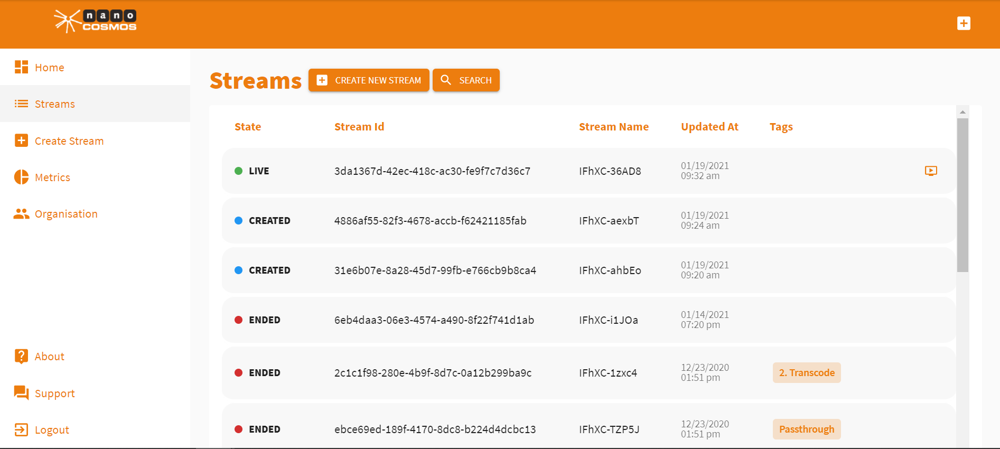

# How to Delete a Stream

A stream can be deleted in its *Stream Overview*.

To find the *Stream Overview* click *Streams* to open your stream list.

Now click on the stream that you want to delete and its *Stream Overview* will open up.

In the *Stream Overview* click *Delete Stream* to delete the stream permanently.

> **_Attention!_** Your stream is deleted permanently. None of its information can be retrieved afterwards.