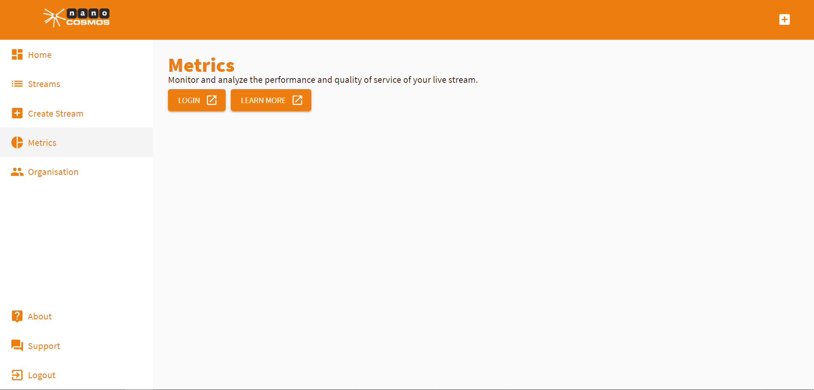

# How to Find Metrics and Analytics

NanoStream Cloud features a wide range of metrics/analytics features to monitor the live stream activity of your customers.

Click *Metrics* on the homepage to find the metrics/analytics section.

You'll have to sign in separately here.

If you need further assistance using metrics/analytics tools, click [here](https://docs.nanocosmos.de/docs/cloud/analytics/).