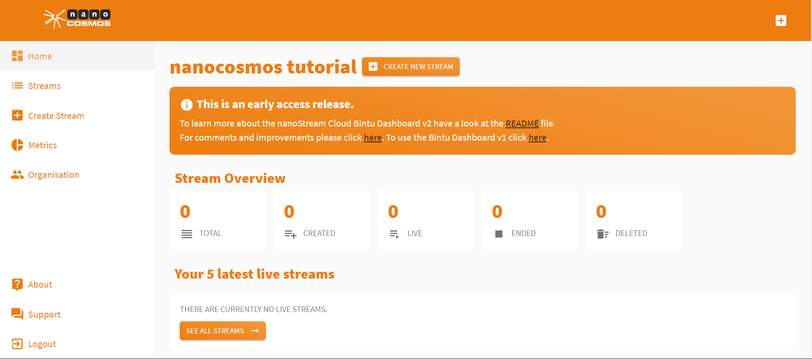
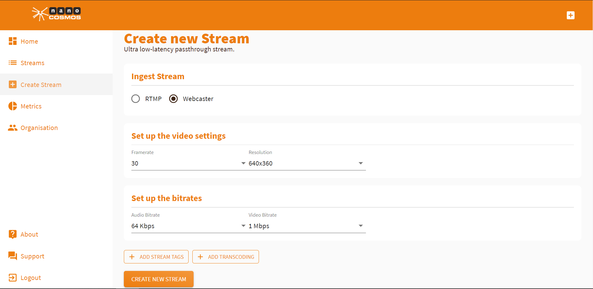
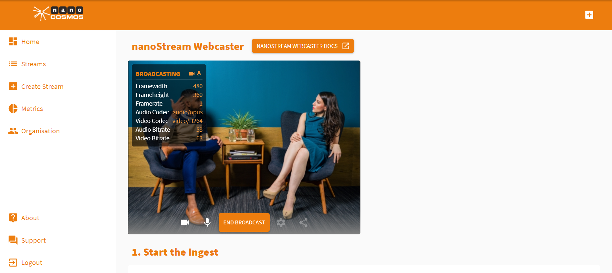
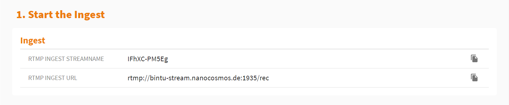
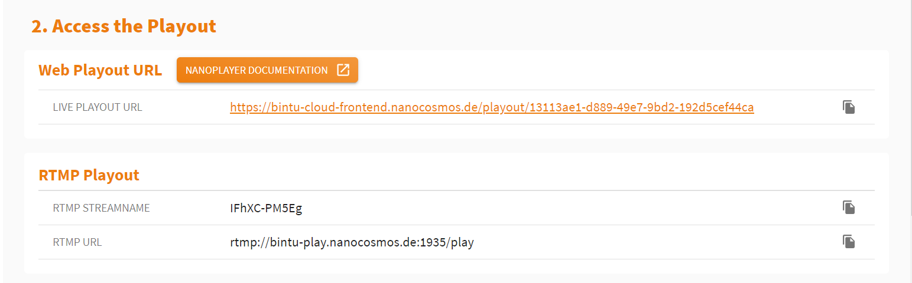
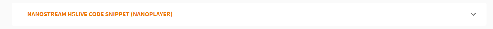
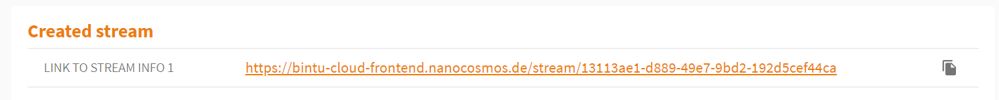
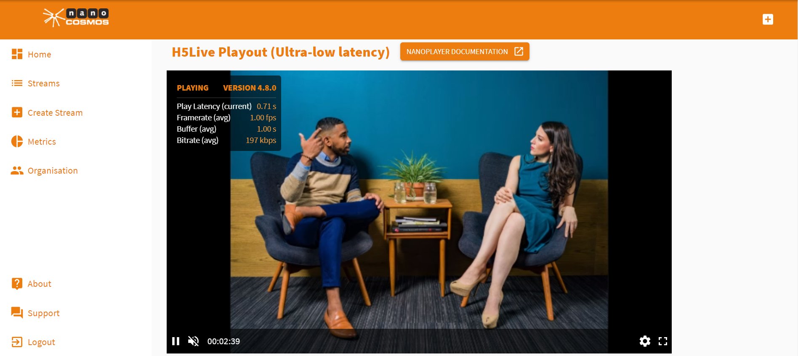

In this tutorial you'll get to know the basic functionality of the nanoStream Cloud:
create, broadcast and watch a live stream with ultra-low-latency. 

The process requires the following steps:

- create a bintu live stream on the dashboard
- configure your live encoder software or Webcaster
- use the nanoPlayer page or API to view the live stream

## Create a Stream

First, [log in](cloud-readme#authentication) to your nanoStream Cloud/Bintu account.

Then, create a bintu live stream with [*Create Stream*](https://bintu-cloud-frontend.nanocosmos.de/stream/create). You can press *Create New Stream* right next to your organization name or press the *plus icon* on the top of the site. Alternatively, you can navigate to the menu on the left hand side and press *Streams* and then *Create New Stream*.

To send a live stream, there are 2 options:

- use a separate live encoder software or hardware (for example OBS). (Read more [here](#use-a-live-encoder))
- use the nanoStream Webcaster web page or API directly from your browser. (Read more [here](#setting-up-a-live-stream-using-the-webcaster))

## Setting up a Live Stream Using the Webcaster

The Webcaster is a browser application that allows you to go live around the world immediately, without a separate setup. 

### Set up the video settings

- You can set up your source resolution and frame rate from a list of prefilled values.
- Select suitable values that fit your needs.
- If in doubt, just keep the default or contact customer support.

### Set up the bitrates

- Similarly, you can set up your audio and video bitrates from a list of prefilled values.
- Select suitable values taking into account network bandwidth considerations.
- If in doubt, just keep the default or contact customer support.

### Add Stream Tag

You can group and tag streams with bintu stream tags. These are human readable words or IDs you can use to identify your streams. This is optional.

- Click on `ADD STREAM TAGS` to add search tags to your stream.
- You can create new tags by typing onto the `Tags` field and hit `Enter` to add it to the list.
- Repeat this for all tags you want to add.
- Or add an existing tag through `Show all tags`. 

### Set up the transcoding profiles

Transcoding allows your stream to perform perfectly adjusted to any network situation. 
> To learn more about adaptive bitrate and live transcoding and how to use it, click [here](How_to_Use_Transcoding.md).

### Start broadcast

As soon as you have adjusted your preferences, press *Create New Stream* and you’ll be redirected automatically to the *Stream Overview*. Press *Start Broadcast* to start your stream directly from the browser.

## Use a live encoder 

You can ingest a live stream with a live encoder software or hardware, using the RTMP ingest streamname and the RTMP ingest URL. 
Click here for information on ingesting a stream with the [OBS software](https://www.nanocosmos.de/blog/2019/03/how-to-use-obs-for-low-latency-live-encoding-to-nanostream-cloud/) or [Wirecast](https://www.nanocosmos.de/blog/2020/12/how-to-use-wirecast-with-nanostream-cloud-for-ultra-low-latency-live-streaming/). 

## Live Playback with nanoPlayer 

You find direct access to the nanoPlayer playout of your live stream. 

If you are a secured organization, you can also  *Create a Secure Playback Token*. (This applies only for secured organizations.)

> To learn more about secure playbacks, click [here](cloud-playback-tokens). 

If you want to embed the stream playout in your own webpage, use the *H5Live Code Snippet*. 

> To get more informations about the H5Live Player and its implementation, see our [documentation](https://docs.nanocosmos.de/docs/nanoplayer/nanoplayer_getting_started/).

The information displayed under *Stream Overview* shows an overview of your created stream(s). 

## Stream Playout

Clicking the *Live Playout URL* opens a new browser tab displaying your stream output. This is the default *H5Live Playout* of your created stream. It also displays important information on your stream.  As you can see, the latency is below one second.

Share the *Live Playout URL* with the people you want to reach and let your stream go around the world in one second!

## Support

Hopefully, this tutorial was helpful for you. For further assistance, use our [contact form](https://www.nanocosmos.de/support), browse the [FAQs](https://docs.nanocosmos.de/docs/faq/faq_streaming/) or contact us via support(at)nanocosmos.de