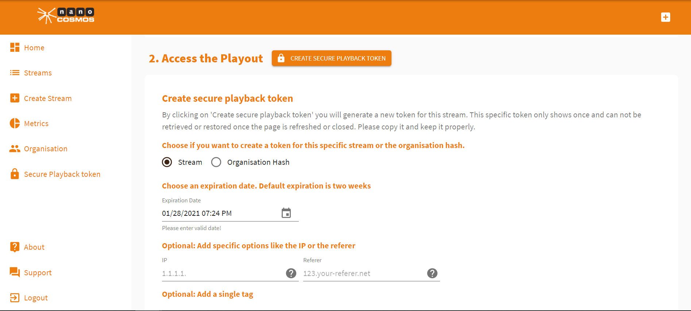
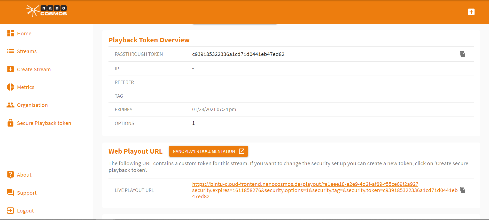
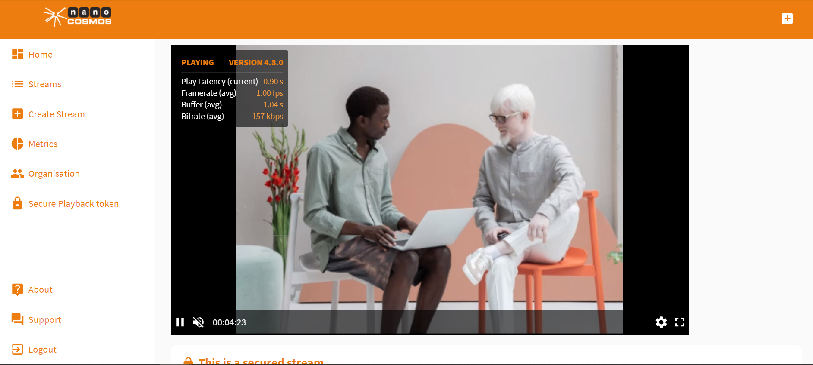
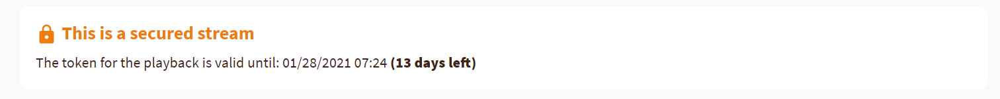
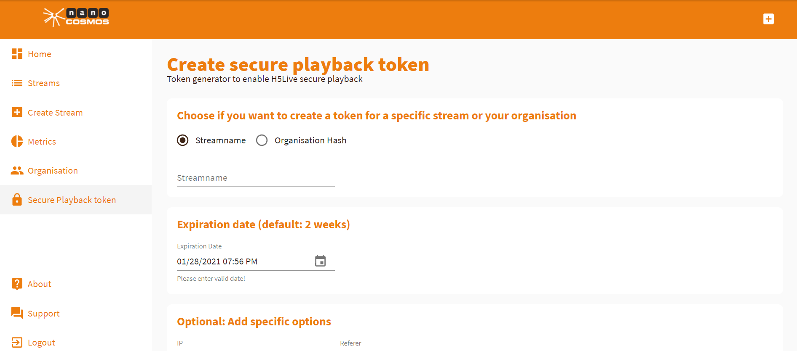
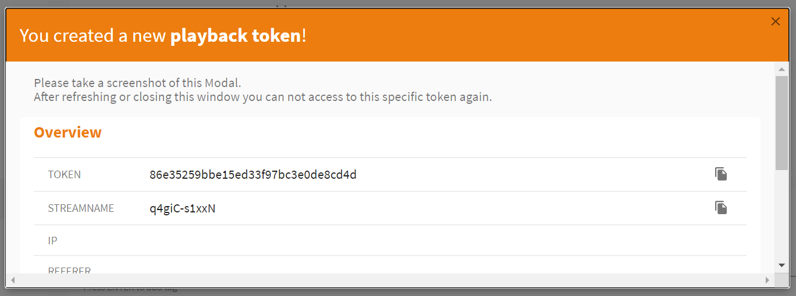
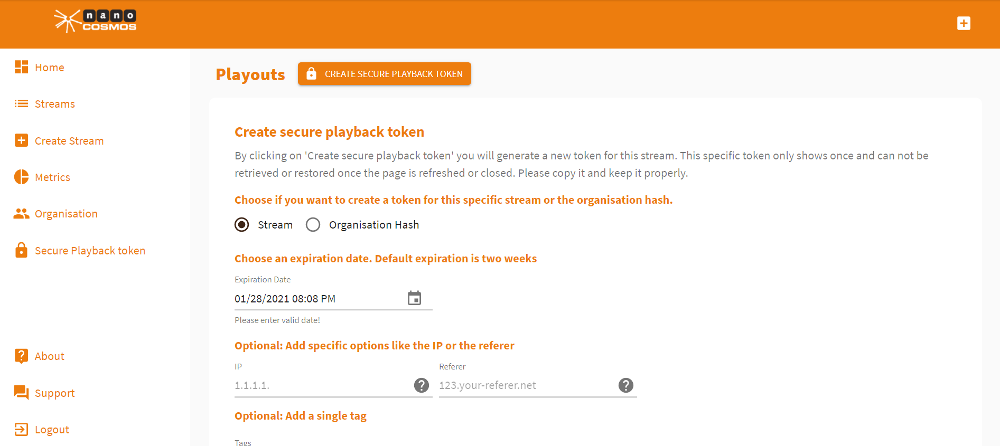

# How to Use Secure Playback Tokens

*Secure Playback Tokens* are a tool that ensures highest security standards for your stream. With tokens you can decide who is able to playback your stream. The mere *playout URL* won't allow your stream to be played out.

#### **Creating secure tokens**

If your organisation has the `secure` option `enabled`, then you will be able to see `CREATE SECURE PLAYBACK TOKEN` option.

- You have to choose between `Stream` which will generate a token that is only valid for the given `streamname` on this setup and `Organisation Hash` where the generated token is valid for **all streams** of your organisation. 
- By default, the expiration date is 2 weeks in the future (can´t be more than 365 days). It is recommended to use short expiration dates to increase the security, so 14 days should be sufficient.
- You can restrict the access/playback of a stream to a specific `IP` or `Referer`. Fill out the corresponding field (please keep in mind if you set a `IP` or `Referer` the generated `Player-Link` will not work, as this requires `demo.nanocosmos.de` as `Referer`).
- *Optional* - `Add a single tag`.
- When everything is ready, hit the `CREATE SECURE PLAYBACK TOKEN` button.
- An updated overview of the new playback token generated will be displayed.

## Step-by-step instructions

### Enabling Security Tokens when Creating a new Stream

If you want your stream to be secured with a token immediately when starting to stream, press *Create Secure Playback Token* in the *Create Stream* overview.

The pop-up menu allows you to make some adjustments. You can choose whether the token you are about to create should cover only this specific streams or all streams of your organization. Also, you are able to set an expiration date of the token and give some more detailed preferences. You can also add a tag. As soon as you press *Create Secure Playback Token* your token will be created.

> ***Attention!***  Please save your token immediately after creating it. It's only saved and can't be retrieved as soon as this page is refreshed or closed. You can generate new tokens any time.

You can find your security token under *Playback Token Overview*. Also, the security token is automatically added to the *Web Playout URL* of your stream.

The *Web Code Snippet* also includes the secure token automatically.

Now you can access the stream playback by opening the *Web Playout URL*.

As you can see, also secured streams are transmitted with a latency of only one second.

The playback page also includes information about the secure token validity. This can be found right underneath the player.

### Adding Secure Tokens after Creating a Stream

On the home page, click *Secure Playback Token* from the menu bar on the right, to create a secure playback token.

Also here you can choose whether you want to create your token only for one stream that is identified by stream name or your whole organization. Moreover, you can edit the expiration date of your token and make further adjustments.

As soon as you press *Create Secure Playback Token* a pop-up window will give you an overview over the token.

> ***Attention!*** Please save your token immediately. After closing this pop-up window, the token can't be retrieved.

### Adding Secure Playback Tokens from the Stream List

Press *Streams* in the menu bar on the left side of the home page to see all your streams. Click on one of them to see it's *Stream Overview*. It's possible to add secure playback tokens here. This works the same way that it works when adding secure tokens while creating a stream. 

Go to *Playouts* and press *Create Secure Playback Token*. Then follow the instructions given above (see: Enabling Security Tokens when Creating a new Stream).

Please also check the nanoPlayer Documentation for further information.

If you are in need of more assistance, reach out to [support](https://www.nanocosmos.de/support)
