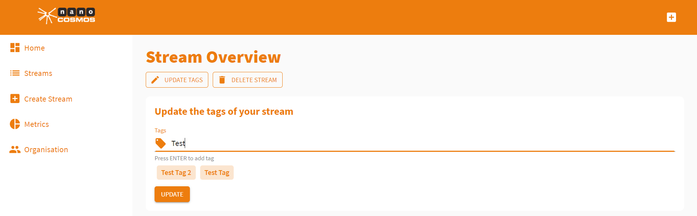
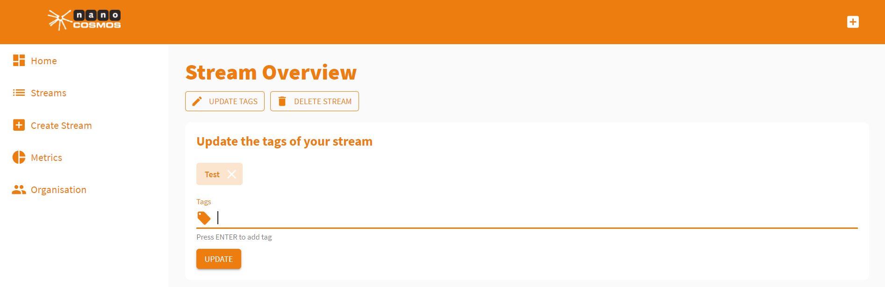
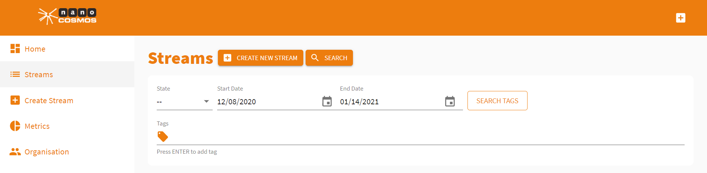

# How to Use Tags

Tags are a helpful tool to organize your streams. They can be used to search for specific streams in your stream list.

### Updating Tags

Stream tags can be updated in the *Stream Overview*. To access the *Stream Overview*, click *Streams* in the left sidebar to update the tags of your streams.

Click the stream that you want to update and you'll be redirected to its *Stream Overview*.

Now click *Update Tags* to update the tags of the stream.

Stream tags can also be added on the *Create new Stream* screen when setting up a new stream.

### Creating Tags

When updating stream tags, it's also possible to create new tags.

While typing in the desired stream tag, you are be able to choose from existing tags (in the picture above: *Test Tag 2* and *Test Tag*) or create a new tag by pressing enter.

In the example the tag *Test* was added by pressing enter. This tag can now be assigned to any of your other streams, too.

### Searching for Streams

To find streams using their assigned tags, click on *Streams* in the menu bar on the left side of the page.

Now click *Search* and *Search Tags* to insert the tags that you want to search for.

This allows you to find streams in your stream list by their assigned tags.

I hope that this tutorial was helpful for you. For further assistance, check our [support page](https://docs.nanocosmos.de/), browse the [FAQs](https://docs.nanocosmos.de/docs/faq/faq_streaming/) or contact us.

