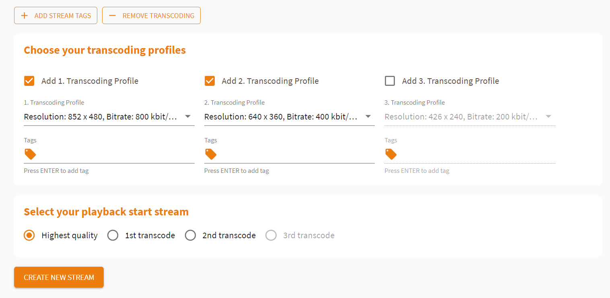

# How to Use Live Transcoding and Adaptive Bitrate Playback

### What is Adaptive Bitrate Playback?

Live Playback of a live stream requires a certain network bandwidth. 
If the bandwidth is not available at the viewer, the stream may start buffering at the viewer device.
To avoid buffering, the stream quality can be reduced by switching to a lower quality stream encoded with a lower bitrate.
With Adaptive Bitrate Playback (ABR), the live player automatically adjusts to the live stream with the best quality for the available network.

A live stream for ABR needs to be available with several quality levels, to adjust to viewer's network bandwidth.

Example: a live stream is available with high quality Full HD 1920x1080 with 3 Mbits/s,
and a Lower resolution stream with 640x360 with 500 kBits/s.

### What is Live Transcoding?

Live Transcoding converts a live stream from a high quality input stream into different lower quality output streams.
You only need to send a single stream from your live encoder / broadcaster, and the live transcoder creates the additional formats, for distribution and playback at the player.

### Functionality

Transcoding and ABR is based on a group of streams. On the customer/viewer side, the stream switch is happening seemlessly in the background, dependent on the internet connection. A typical setup is a single ingest (input) and 3 outputs, with 1 "passthrough" (same input quality) and 2 lower resolution streams.

Example:

- Ingest/Input and highest quality: 1920x1080 3 Mbit/s
- Output 1 (High/Passthrough): 1920x1080 3000 Kbit/s (= 3 Mbit/s)
- Transcode 1 (Medium): 852x480 800 Kbit/s
- Transcode 2 (Low): 640x360 400 Kbit/s

### How to Enable Adaptive Bitrate

Adaptive Bitrate Playback with nanoPlayer does not require server-generated live transcoding. You can also create 3 live streams with the same content but different bitrates from your live encoder.
Typically, live transcoding is done on the server to avoid sending 3 separate streams.

### How to Enable Live Transcoding

Live Transcoding with nanoStream Cloud can be enabled when creating a new stream. In the *Create new Stream* preferences, click *Add Transcoding* to adjust your transcoding profiles.

NOTE: Your account needs to be enabled for live transcoding to use this feature.

#### Setting up live transcoding

- Click on `ADD TRANSCODING` to add transcoding functionality to your ingest setup.
- You should now be able `choose your transcoding profiles`.
- To add the first transcoded stream, select `Add 1. Transcoding Profile`. It is prefilled with our recommended default selection. You can select another setting, but the bitrate needs to be lower than the ingest/passthrough bitrate.
- To add a second transcoded stream, select `Add 2. Transcoding Profile`. You can choose another selection, but the bitrate needs to be lower than the 1st transcoded stream bitrate.
- To add a third transcoded stream, select `Add 3. Transcoding Profile`. You can choose another selection, but the bitrate needs to be lower than the 2nd transcoded stream bitrate.

Add or remove profiles depending on your needs. Select the first version that should be loaded to the playout.

Copy the ingest URL and stream name to your live encoder. 

Press *Create New Stream* to create the stream with your chosen transcoding profiles.

Click *Start Broadcast* on your live encoder or webcaster.

### **Create ABR-Streams**

Once all settings have been done, press the `CREATE NEW STREAM` button.  
After the custom stream configuration has been created, a new webpage will be displayed that shows all the important information regarding the new stream/streams created.

### Live Player 

Scroll down and click the link under *Access ABR playout* to access the playout of your transcoded stream.

#### **Choosing a playback stream to start**

This enables the selection of which stream quality the playback starts with.

- Starting with the `Highest quality` will start with the `Passthrough Stream` = quality from your live encoder ingest. This will always work for the viewers but on bad network conditions, the ABR player will auto-switch to a lower quality and enable a seamless live playback without bufferings.

- When starting with lower stream quality (`1st or 2nd or 3rd transcode`, depends on choosen transcoding streams), the viewer starts with lower quality, and switches to higher quality levels after some seconds. 

> **Attention!** Please save your *Web Playout URL* at this point. It's not accessible from the *Stream Overviews* of the single transcoded streams and can't be restored later.

On the playback side, *Adaptive Bitrate Controls* allows you to choose whether the stream version should be switched automatically or manually. If *Manual* is ticked, you can choose one of the quality versions yourself.

The *Full Stream Info* displays all information on your different transcoded stream versions.

[To learn more about creating streams with the nanoStream Cloud, click here.]

I hope that this tutorial was helpful for you. For further assistance, check our [support page](https://docs.nanocosmos.de/), browse the [FAQs](https://docs.nanocosmos.de/docs/faq/faq_streaming/) or contact us.
