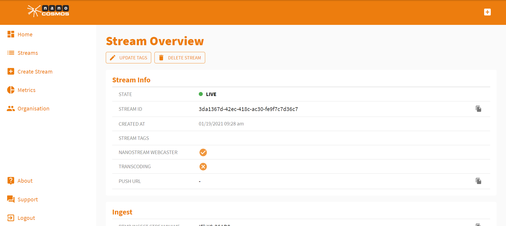
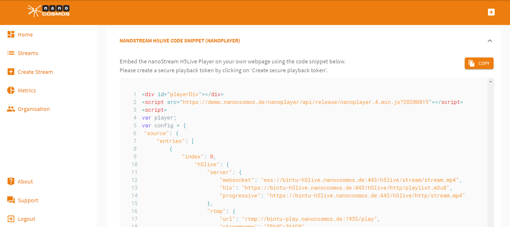
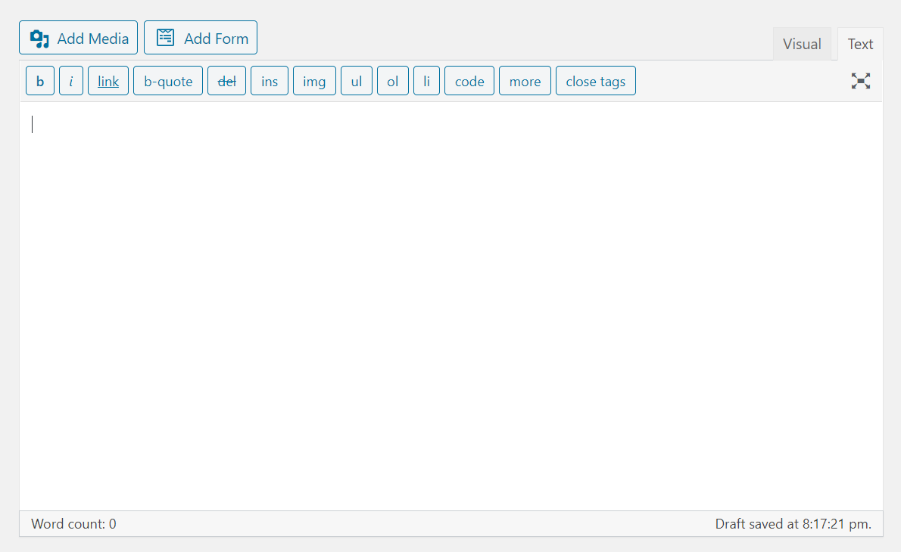
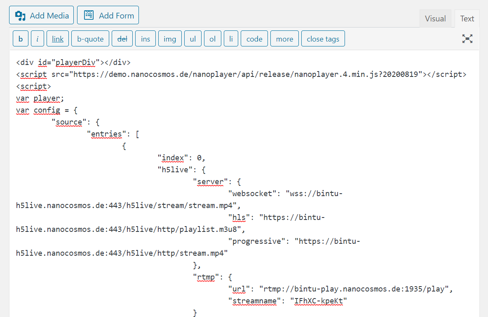
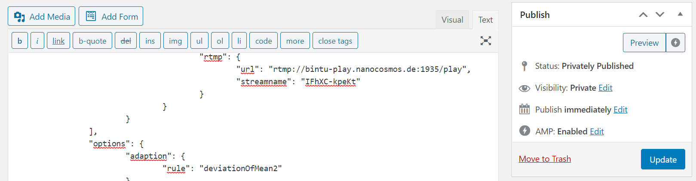

# How to Embed a nanoStream on Your Website

Embedding a live stream into your own website is really simple. Every nanoStream has its unique code snippet that is updated automatically to your setup - you only have to copy and paste it to the right place.

### Finding the nanoPlayer Code Snippet

The nanoStream H5Live Player Code Snippet can be found in the *Stream Overview* of the stream that you want to embed. You can find the *Stream Overview* from your stream list. Click on *Streams* on the left side of the homepage to find a list with all of your created streams.

Clicking on one of the streams here will open up its *Stream Overview*.

Now scroll down to the *Nanostream H5Live Code Snippet (Nanoplayer)*.

Now click :arrow_down_small: and press *Copy* to copy the code snippet.

Now you can insert the code snippet on your own website. 

### Inserting the Code Snippet on a Wordpress Website

Create a new post on Wordpress and Click on *Text*.

Now paste the code snippet.

Having added the code snippet to the text box, click *Publish* or *Update* on the right-hand side of the page to publish the post.

Now check out your new post.

Your stream goes around the world in one second!