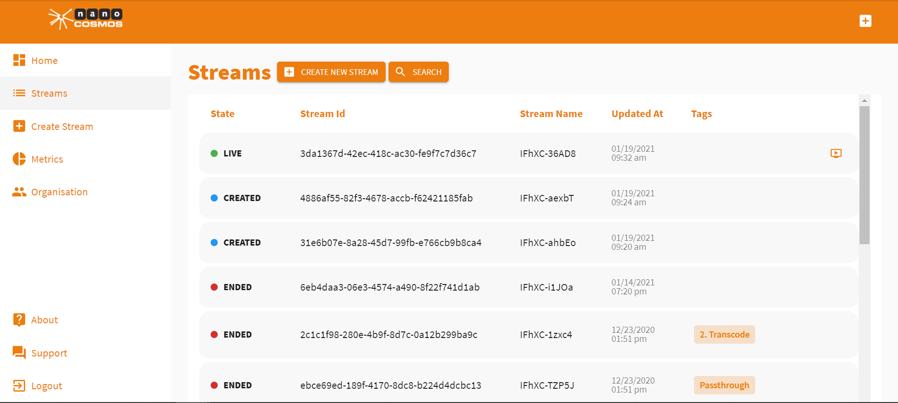

# How to Use the Stream List

The stream list displays all of your streams. It includes streams that are live, created and expired.

### Finding the Stream List

Click *Streams* on the right-hand side of the homepage to find the stream list. 

Clicking on one of the streams will open up its *Stream Overview* displaying important parameters of the stream.

### Stream Status

As you can see, some streams are displayed as *Live*, some as *Created* and some as *Ended*.

These terms refer to the status of each stream. A stream that is live is right now sending a live video. A created stream is not yet sending a video and a stream that has ended is not anymore outputting footage.

### Stream IDs and Stream Names

Stream names and IDs are important identifiers for each stream. 

### Working with Tags

The stream list also shows the tags that are assigned to each stream. This is helpful for example when searching for a specific stream. Click *Search* and then *Search Tags* to filter your streams by tag. You can also search the stream list using the date a stream was created.