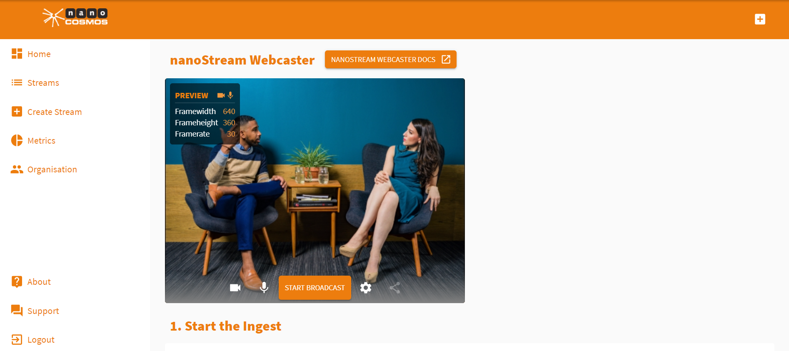
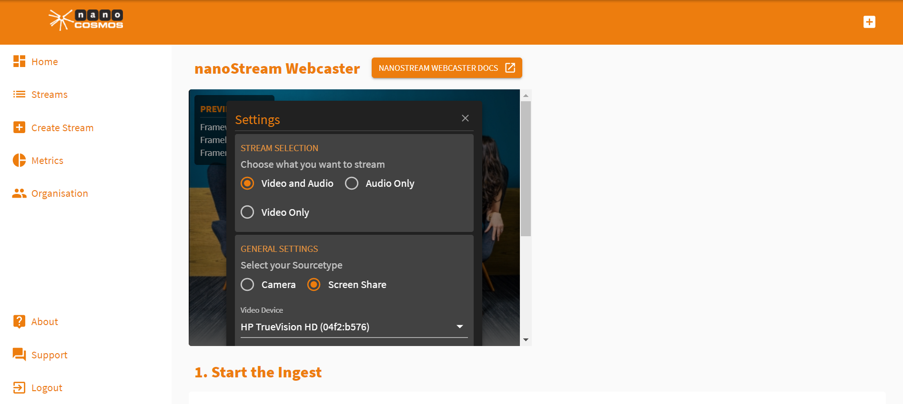

The nanoStream Webcaster is an online application that allows you to easily stream directly from your browser.

## Ingesting a Stream

When creating a stream using the nanoStream Cloud, you'll be asked whether you want to ingest the stream via the Webcaster or RTMP.

Ingesting a stream means sending the footage that you want to share. The ingest therefore is the first step if you want to share something live.

## Ingest Using the Webcaster

Using the Webcaster to ingest is the easiest way to start.

In the *Create Stream* interface, tick *Webcaster*. Now press *Start Stream*. You'll be redirected to your Webcaster stream setup.

To change your stream preferences, click :gear:. In the pop-up window, you can now adjust the framerate and resolution, the quality and the source of your stream.

[To learn more about how to start a stream, click here.] 

I hope that this tutorial was helpful for you. For further assistance, check our [support page](https://docs.nanocosmos.de/), browse the [FAQs](https://docs.nanocosmos.de/docs/faq/faq_streaming/) or contact us.

## Support

Hopefully, this tutorial was helpful for you. For further assistance, use our [contact form](https://www.nanocosmos.de/support), browse the [FAQs](https://docs.nanocosmos.de/docs/faq/faq_streaming/) or contact us via support(at)nanocosmos.de