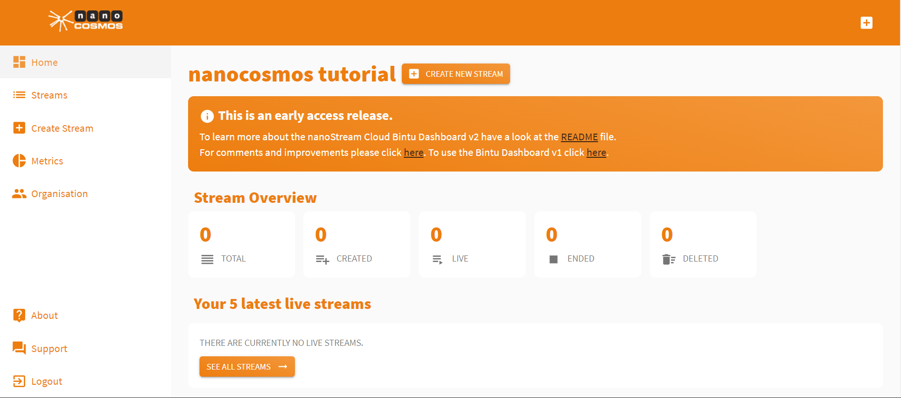
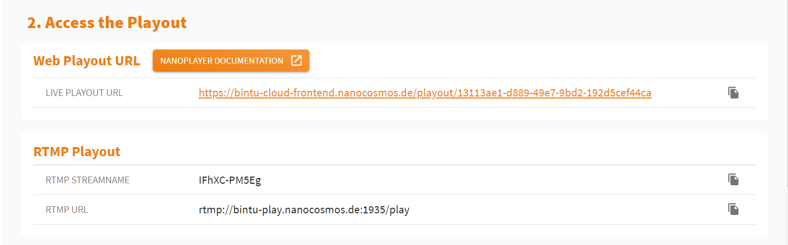

# nanoStream Cloud Dashboard v2

<AUTOGENERATED_TABLE_OF_CONTENTS>

### What is this?

nanoStream Cloud is releasing a new Stream Management Dashboard to help you improve your streaming workflow. It will help you to create, customize and manage streams in a new intuitive way.

The cloud dashboard is the frontend for the bintu API for stream management.
Every stream has at least:

- one ingest stream which is used by your live encoder connected to a live source (camera)

- one playout stream which can be played with nanoPlayer on all browsers

### What's new

- Create transcoded streams (depending on business agreement)
- Create secured streams 
- See playback immediately
- Intuitive way of creating and customizing a new stream
- New Stream Overview
- Steps to playout (from Ingest to Playout)
- Dashboard with compact overview

## Getting started

### [Sign Up/ Sign In](https://bintu-cloud-frontend.nanocosmos.de/auth)

If you do not have a bintu account yet please click [here](https://bintu-cloud-frontend.nanocosmos.de/auth?signup) to create a new account.

To [sign in](https://bintu-cloud-frontend.nanocosmos.de/auth?login) use the credentials you usually use to sign in to bintu.

### [Dashboard](https://bintu-cloud-frontend.nanocosmos.de/)

After logging in successfully you will be redirected to the [dashboard](https://bintu-cloud-frontend.nanocosmos.de/).

The overview shows your total streams, your total live streams, all users and tags of your organisation. By clicking on the boxes you will be redirected to the page that includes the full overview. 
Below your 5 latest live streams are shown. To see all, click on the "[See all streams](https://bintu-cloud-frontend.nanocosmos.de/stream)" button.

### [Create Stream](https://bintu-cloud-frontend.nanocosmos.de/stream/create)

Only one click ("[Create new stream](https://bintu-cloud-frontend.nanocosmos.de/stream/create)") is required to create a new stream. If you want to customize the stream, there are two possibilities to do that (Add tags, Add Transcoding). They are all optional.

1. **Add Stream Tags**

  To add `stream tags` you can either type them manually in or choose from your existing ones.

2. **Add Transcoding Profiles**
   If your organisation has been enabled our "transcoding" feature, your are able to set `transcoding profiles` to create a transcoded stream. You can choose from several profiles and add tags to the profile.

### New stream

After creating a new stream, you see an overview with all information you need to start a stream.

1. **Start the Ingest**
   In this section the ingest informations are placed including `RTMP streamname` and `RTMP URL`. You can copy them by clicking on the copy icon on the right end of the row.

2. **Access the Playout**
   In this section you can see the `live playout URL`. **By clicking on it, you can also see a code snippet which is all you need to embed the H5Live Player with your stream into your web page**. To get more informations see our [documentation](https://docs.nanocosmos.de/docs/nanoplayer/nanoplayer_getting_started/).

If your organisation has enabled our "secure" feature you will be able to click on the `live playout URL` without having to create a new token. This is going to happen in the background. The token will be valid for an hour.
If you want to create a customized token, you can do that by clicking on the "Create Secure Token" Button next to the Header. There you can set up an `expiration date` and specific options like the `IP` or `referer` and a `single tag`. 

After creating it, you will see a new `playout URL` you can share. **Please copy the URL before refreshing or closing the window**. After doing that you can not access to this specific token again and will have to create a new one.

3. **Stream Overview**
   This section lists all created stream. If you created a stream without transcoding, there will be only one. If not, there will be up to three. By clicking on the URL you can see the whole stream overview including several other informations.

### Stream Overview

The stream overview shows all informations the stream is providing, including the stream info (`state`, `streamid`, `created at`, `stream tags`, `timecode`, `transcoding`, `push url`), the ingest informations (`RTMP streamname`, `RTMP url`) and the playout informations (H5Live (Ultra-low latency), H5Live config object, RTMP Playout, HLS Playout). You can copy properties to the clipboard by clicking on the copy button on the right.

You are able to update the stream tags, after creating a stream. To do that, you need to click on the button on the top called "Update tags". 

After clicking on "update" the tags you added will be visibile in the overview and the tags you removed will be deleted.

By clicking on the "Delete stream" button you will be asked if you are sure about that. After confirming, you will be redirected to the stream list.

If your organisation has enabled our "secure" feature, your are able to create a customized secure token aswell.
If you want to create one, you can do that by clicking on the "Create Secure Token" button. On this way you can set up an `expiration date` and specific options like the `IP` or `referer` and a `single tag` for the stream. 

### [All Streams](https://bintu-cloud-frontend.nanocosmos.de/stream)

The stream list shows all streams of your organisation. By clicking on one stream, you will be able to see the stream overview. The pagination on the bottom gives you the oportunity to browse through your streams.

Streams that are live have an "Open Playout" Button at the end of the table row. By clicking on it, the playout will be opened in a new tab. Otherwise you will be redirected to the stream overview.

You can filter them by clicking on the "Search" Button and search for stream tags, specific states, such as `created`, `live`, `ended`, `deleted` and specific start and end dates. 

### [Metrics](https://bintu-cloud-frontend.nanocosmos.de/metrics)

By clicking on the menu item "[Metrics](https://bintu-cloud-frontend.nanocosmos.de/metrics)" you will be able to choose between two buttons called "[Login](https://metrics.nanocosmos.de/#/login)" and "[Learn more](https://docs.nanocosmos.de/docs/cloud/analytics/)". By clicking on the first button the nanoStream Analytics tool will be opened in another tab, while clicking on second button opens the nanocosmos blog.

### [Organisation](https://bintu-cloud-frontend.nanocosmos.de/organisation)

This page gives you an overview about your organisation, informations depending on that and your enabled features.

The features are visible on the top of this page. If they are orange, your organisation enables them. If they are grey it does not and you need to contact the [sales](mailto:sales@nanocosmos.de) team, if you would like to change that.

Underneath that you can see your organisation name and its hash. The Organisation hash is the part of every stream name you create. 

By clicking on the dropdown item under the title "Keys" you will be able to see your API key. Please keep it private.
"All user" gives you an overview about the user your organisation has. They can be sorted (asc/desc) by the date they are created at or by emails.

Below that you can see "All tags". You have the oportunity to create a new one or scroll through existing ones.

### [Create Secure Token](https://bintu-cloud-frontend.nanocosmos.de/secure/token)

If your organisation enables our feature "secure" you will be able to see this menu item. You can create a custom token for a specific stream or the whole organisation.

Thank you for being our valued partner and we appreciate your feedback on how we can improve and optimize your streaming workflow.

Your nanocosmos-Team.

## Release Notes

### [2.1]

**New features**

- **Create Stream**

  - Creating a stream lets you choose between "RTMP" and "Webcaster".
  - For the nanoStream Webcaster you can set the specific resolution and bitrate for broadcasting.

  

- **Stream Overview**

  - Now you can directly share the nanoStream H5Live playout with third parties or colleagues.

- Secure organisations: You can see a content overview of the token used for the playback URL and the code snippet.

  

- **nanoStream H5Live Player**

  - For secured streams: Displayed countdown allows you to see the remaining time the applied token is valid.

  - For transcoded streams:

    - Auto or manual mode for switching stream qualities.
    - Overview of all streams that are part of the transcode group, including bitrate, frame rate, resolution.

**Updates**

- A consolidated stream overview has been added to the dashboard.
- Updated the external playout URL for streams with transcoding profiles.
- **Once transcoded streams have been created, copy the URL for future retrieval.**
- The nanoStream H5Live code snippet, which can be directly embedded on any website, is now part of the Stream Overview/Playouts section.

- **Playback token**

  - For authorized organisations and their standard token: The previously applied single hour has been extended to 24 hours.
  - Simplified process to create custom token and customize playback URL as well as code snippet.

**Fixes**

- Firefox: Transcoded streams are now sorted correctly.
- Applied search filter now consider the total amount of matching streams.

### [2.0.2]

**New features**

- New H5Live Player Widget can be accessed from within the dashboard now. 
  More intuitive and easy-to-use.
- Faster implementation of the H5Live Player code into your webpage.
  Code snippets are available in all single stream overviews, newly created streams and all playout. (Also for transcoded and secured streams)
- Recent tags are shown when filtering through all streams.

**Updates**

- H5Live playback with the icon at the end of the row of every live stream.
- Shortening of the playback- and newly created streams URLs.

**Fixes**

- Filter are now still applied after updating the amount of "rows in a page".

### [2.0.1]

**New features**

- Show up to 150 streams per page
- Standard: every new stream created is supported  by the nanoStream Webcaster
- Filter tags by regex in "Streams", "Create new Stream"
- Create Invite Token for a new user and signing up using the invite token

**Updates**

- None

### [2.0.0]

**New features**

- Create transcoded streams (depending on business agreement)
- Create secured streams 
- See playback immediately
- Intuitive way of creating and customizing a new stream
- New Stream Overview
- Steps to playout (from Ingest to Playout)
- Dashboard with compact overview

**Changed**

- None
