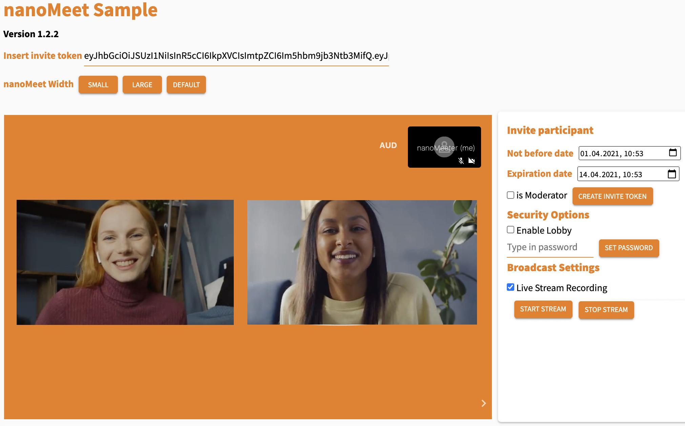

nanoMeet is part of [nanoStream Cloud](https://bintu-cloud-frontend.nanocosmos.de). 
You need a nanoStream Cloud/Bintu account with nanoMeet enabled.

> *If you do not have an account or nanoMeet enabled yet, please contact our sales team via [contact form](https://www.nanocosmos.de/contact) or sales(at)nanocosmos.de.*
>
> To check if your organisation enables nanoMeet, check your [organisation overview](https://bintu-cloud-frontend.nanocosmos.de/organisation).
>
>  


## Embedding nanoMeet on your own web page

You can embed the following code snippet to test nanoMeet on your page in no time. It is a recommended example and runs on any web page. 

> **Note**: To make this code snippet run, you need to **create a new nanoMeet room first**. <br/>
> Execute this step via the nanoMeet web API using the method [createNanoMeetRoom](api#nanomeetcreatenanomeetroomapikey-roomsetup--promisesuccesserror) or using our [nanoMeet Token Creator (Online Sample)]((https://nanomeet.pages.nanocosmos.de/nanomeet-frontend/nanomeet-helper.html?bintu.apikey=YOUR-API-KEY&nanomeet.room=YOUR-ROOM-NAME)). <br/>
> Both approaches will generate a **new secure invite token** that can be used to enter a nanoMeet room.


```html
// Code to embed a nanoMeet meeting room on a web page
<div id="nanoStream-meet"></div>
<script src="https://nanomeet.pages.nanocosmos.de/nanomeet-frontend/js/nanomeet.js"></script>
<!-- The div element the nanoMeet room will be embedded into -->
<script>
    var nanoMeet = new NanoMeet(); // Instance of the nanoMeet web API
    var token = "SECURE-TOKEN" // Your secure invite token

    // Initialization of the nanoMeet player
    document.addEventListener('DOMContentLoaded', function () {
        nanoMeet.init({ token, id: "nanoStream-meet" })
            .then((success) => {
                console.log("nanoMeet setted up...", success);
            }).catch((error) => {
                console.log("Error setting up nanoMeet", error);
            });
    })
</script>
```

## Online Samples

1. Open the [nanoMeet Token Creator](https://nanomeet.pages.nanocosmos.de/nanomeet-frontend/nanomeet-helper.html?bintu.apikey=YOUR-API-KEY&nanomeet.room=YOUR-ROOM-NAME) to create a new secure token.  - (See [source code](source-code#nanomeet-token-creator-source-code)) 


2. Insert your API key from [nanoStream Cloud/Bintu Organisation](https://bintu-cloud-frontend.nanocosmos.de/organisation).
3. Name the room you want to create.
4. Choose the server location.
5. Set a time frame in which your secure token will be valid for the participants to join the nanoMeet room.
6. Click on "create".
   - Full Stream Overview: See the full stream overview in the [nanoStream Cloud dashboard](https://bintu-cloud-frontend.nanocosmos.de/), including a code snippet, the playout URL and the stream names.
   - Open room: Use the invite link to launch your created room in the [nanomeet Sample](https://nanomeet.pages.nanocosmos.de/nanomeet-frontend/nanomeet-sample.html?token=) we provide.  - (See [source code](source-code#nanomeet-sample-source-code)). If you have the [role of a "moderator"](introduction#roles) you can also see settings with several functions like [creating an invite token](#create-an-invite-token-via-nanomeet-sample),  [starting a live stream](#start-a-live-stream-) or [turning on the lobby](#turn-onoff-the-lobby-)

   

## Create a nanoMeet room via nanoMeet Token Creator

To create a room you need to provide the following informations
 - Bintu API key
 - nanoMeet room
 - nanoMeet geolocation
 - Exipration time frame
  - Not Before Date
  - Expiration Date

## Create an invite token via nanoMeet Sample

You can create an invite token via the [nanomeet Sample](https://nanomeet.pages.nanocosmos.de/nanomeet-frontend/nanomeet-sample.html?token=) with the [role of a "moderator"](introduction#roles).
You can customize it in the "Invite participant" section by setting the following informations:
- Not Before Date
- Expiration Date
- isModerator


## Customize a nanoMeet room

You can customize your nanoMeet room with your branding easily.
For that you need to set up a JSON file. Every property in this object is optional, when nothing is set, the default, our nanocosmos branding, will be used.

**Example branding set up**

```json
{
    "backgroundColor": "#ed7d0e",
    "backgroundImageUrl": "https://nanomeet.pages.nanocosmos.de/nanomeet-frontend/img/bg.png",
    "logoClickUrl": "https://nanocosmos.de/v6/",
    "logoImageUrl": "https://nanocosmos.de/v6/images/logo-nav.png"
}
```

## Start a live stream ...

> To start a live stream you need to have the "moderator" [role](introduction#roles).

You can stream your nanoMeet room around the world in 1 second.

### ... (a) via *"Broadcast Settings"* (nanoMeet Sample)

To start a live stream to the nanoStream Cloud you can click the button "Start stream" in the "Broadcast Settings". You will see a live playback URL which you can share with your audience (e.g. https://demo.nanocosmos.de/nanoplayer/release/nanoplayer.html?..) and a vod playback URL if you choose to record the live stream.


### ... (b) via nanoMeet UI

To start a live stream via the nanoMeet UI you need to click on the three dots on the right and click on the "Start nanoStream Cloud live stream". The dialog will ask you to insert the ingest informations. You should provide it using this format: `rtmp://rtmp-bintu-ingest-url:1935/rec/XXXXX-YYYYY`.

## Turn on/off the "Lobby" ...

> To turn on/off the "Lobby" you need to have the "moderator" [role](introduction#roles).

The Lobby is a waiting room where particiapnts have to wait until the moderator of the room accepts  them to join the meeting. Its turnt off per default.


### ... (a) via *"Security Options"* (nanoMeet Sample)

To turn on the lobby via the nanoMeet Sample you can click on the "Enable Lobby" checkbox in the "Security Options". 
[Participants](introduction#roles). that want to join will have to wait until the [moderator](introduction#roles) accepts them.

> Turning on the lobby sets a password "changeme" per default. **Change it!** <br/>
> This password lets you join the meeting by entering it in the textfield displayed in the lobby".
> It's helpful if you e.g. accidentally leave the meeting and want to join again or want someone else to join without the need to let them in by hand.

### ... (b) via nanoMeet UI

The nanoMeet UI provides an orange "Guardian Icon" on the right side of its window. Clicking on it the security dialog will open and give you the opportunity to activate the lobby. The "Guardian Icon" turns green by activating the lobby.

> Please be aware that in this case there will be no default password! If you e.g. accidentally leave this nanoMeet room you can't join if you are the [moderator](introduction#roles).

## Watch a live stream within nanoMeet (Watchparty)

To start a watchparty click on the three dots right on the toolbar. Toggle "Start watchparty" and insert a nanoStream Cloud streamname (e.g. `HX26g-1Qs78`). You can also paste ABR streamnames following this format (e.g. `XXXXX-YYYY1,XXXXX-YYYY2,XXXXX-YYYY3`). The nanoPlayer will be shown within the meeting room and can be controlled by the [moderator](introduction#roles).


