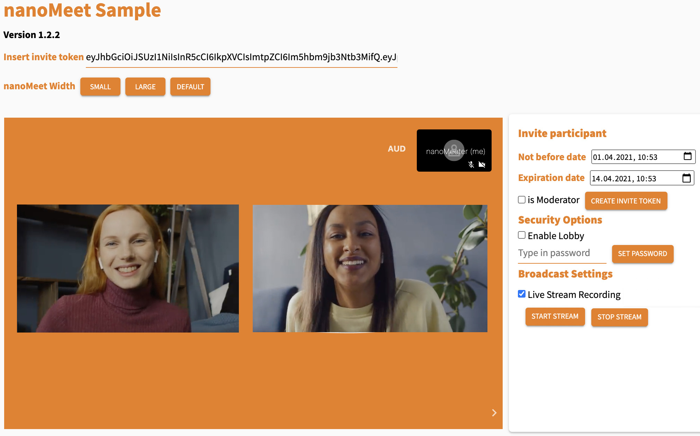

# nanoMeet 

&copy; 2021 [nanocosmos](info.nanocosmos.de)

## What is nanoMeet?

nanoMeet is a browser-based live video and collaboration platform connected to nanoStream Cloud, for interactive live streaming.
It allows you to create your own branded video meeting rooms in the browser to engage and interact with your audience. 
nanoMeet is based on a custom version of [Jitsi Meet](https://github.com/jitsi/jitsi-meet) and integrated with [nanoStream Cloud](https://info.nanocosmos.de)

## Key features

With nanoMeet you can create, host and broadcast online video meetings on you own web page:

- Host online video meetings embedded on your own web page
- Web browser based applications and web services
- Live streaming integration with nanoStream Cloud
- Enable audience interaction with large audiences (1000s of participants anywhere in the world)
- Invite participants with secure tokens
- nanoMeet web API and code examples for easy white-label integration into custom branded environments
- „Watch party“: Watch a live stream together in a video meeting
- Run everything under your own brand (white label)

## Example applications

There are various usecases for nanoMeet:

- Town Hall Meetings, e.g. company webcasts
- Podium Discussions, e.g. expert sessions
- Interviews and announcements with Q&A, e.g. press briefings
- Live events, e.g. music, comedy, …
- Fan engagement, e.g. meet and greet
- Watchparties, e.g. watch a live stream together and discuss

## What is part of nanoMeet?

- Web services for usage 24/7 anywhere in the world
- Sample pages for setting up and using nanoMeet rooms
- Web API with code snippets/example implementations
- Live Streaming: Integration into nanoStream Cloud (Bintu)

### Requirements

nanoMeet is part of [nanoStream Cloud](https://bintu-cloud-frontend.nanocosmos.de). 
You need a nanoStream Cloud/Bintu account with nanoMeet enabled.

> *If you do not have an account or nanoMeet enabled yet, please contact our sales team via [contact form](https://www.nanocosmos.de/contact) or sales(at)nanocosmos.de.*
>
> To check if your organisation enables nanoMeet, check your [organisation overview](https://bintu-cloud-frontend.nanocosmos.de/organisation).
>
>  

## Quick start - nanoMeet Demo 

For developer and API info see [README](README.md) / [HTML Version](readme)

### Create a nanoMeet room

To create a room you need a valid bintu api key.

1. Open the [nanomeet-helper](https://nanomeet.pages.nanocosmos.de/nanomeet-frontend/nanomeet-helper.html?bintu.apikey=YOUR-API-KEY&nanomeet.room=YOUR-ROOM-NAME) to create a token.  - (See [source code](nanomeet-helper.html)) 
2. Insert your API key from [nanoStream Cloud/Bintu Organisation](https://bintu-cloud-frontend.nanocosmos.de/organisation).
3. Name the room you want to create.
4. Set a time frame in which your secure token will be valid for the participants to join the nanoMeet room.
5. Click on "create".
   - Full Stream Overview: See the full stream overview in the [nanoStream Cloud dashboard](https://bintu-cloud-frontend.nanocosmos.de/), including a code snippet, the playout URL and the stream names.
   - Open room: Use the invite link to launch your created room in the [nanomeet-sample](https://nanomeet.pages.nanocosmos.de/nanomeet-frontend/nanomeet-sample.html?token=) we provide.  - (See [source code](nanomeet-sample.html))

## Contents 

Enabling **nanoMeet** for your organisation gives you access to create, use and broadcast nanoMeet rooms. For that you can either use our samples that utilize our nanoMeet web API or create your own code using our documentation.

1. **nanoMeet Helper** - Create a room and secure invite token
   Lets you create a secure token with moderator rights with which you can join and invite people in to a nanoMeet room.
   
> Available as [online web page](https://nanomeet.pages.nanocosmos.de/nanomeet-frontend/nanomeet-helper.html?bintu.apikey=YOUR-API-KEY&nanomeet.room=YOUR-ROOM-NAME) and [source code](nanomeet-helper.html) to integrate.

2. **nanoMeet sample web page** - Host nanoMeet meetings
   Lets you use nanoMeet with a valid secure token. Using this sample in a moderator role lets you invite people, set up security options and start a broadcast incl. recording.
> Available as [online web page](https://nanomeet.pages.nanocosmos.de/nanomeet-frontend/nanomeet-sample.html?token=YOUR-INVITE-TOKEN) and [source code](nanomeet-sample.html) to integrate.

3. **nanoMeet Web API** - All nanoMeet functions
   

This nanomeet.js file lets you access all nanoMeet functions and procedures.

   > The usage is described in the [nanoMeet API documentation](README.md).

## How to use nanoMeet

To use nanoMeet you can either use our online samples or write your own code.

Follow these steps to create secure video meeting rooms with

1. nanoMeet Samples 
   1. Create a new nanoMeet room with a secure token for a moderator
   2. Create invite secure token with participant/moderator roles
   3. Open the meeting room
   4. Optionally: Share the meeting as a live stream using nanoStream Cloud to your large audience

Read the section "How to use nanoMeet Samples" to get further instructions

2. nanoMeet Web API 
Read our [developers documentation](README.md)) 

### Roles

There are two main Roles

- Moderator: Is able to create invite tokens for participants and moderators, start live streams and customize the nanoMeet room.
- Participant: Is able to join a nanoMeet room.

## <a name="quick-start">How to use nanoMeet Samples? </a>

### 1. Create a nanoMeet room

Sample that lets you create a new nanoMeet room.

> **Required**: nanoStream Cloud/bintu API key. (Click [here](https://bintu-cloud-frontend.nanocosmos.de/organisation) to find your API key.)

1. Open the [nanoMeet Helper](https://nanomeet.pages.nanocosmos.de/nanomeet-frontend/nanomeet-helper.html?bintu.apikey=YOUR-API-KEY&nanomeet.room=YOUR-ROOM-NAME).

2. Insert your nanoStream Cloud/Bintu API key.

3. Name the room you want to create.

4. Set a time frame in which the secure token will be valid for the invitees to join the nanoMeet room.

5. Click on "create".
   - **Full Stream Overview**: See the full stream overview in your nanoStream Cloud dashboard, including a code snippet, the playout URL and the stream names.
   - **Open room**: Use the invite link to launch your created and secure nanoMeet room in our [nanoMeet Sample](https://nanomeet.pages.nanocosmos.de/nanomeet-frontend/nanomeet-sample.html?token=YOUR-INVITE-TOKEN).

   

### 2. Use and customize your nanoMeet room

This sample lets you intialize your created nanoMeet room. If you dont use this sample as a moderator but as a participant you will not be able to see the "Moderator Functions" like "Invite Participant", "Security Options" and "Broadcast Settings".

> **Required**: A valid secure invite token for a nanoMeet room. (Click [here](https://nanomeet.pages.nanocosmos.de/nanomeet-frontend/nanomeet-helper.html?bintu.apikey=YOUR-API-KEY&nanomeet.room=YOUR-ROOM-NAME) to create a new secure token.)

##### Start a live stream via the "Moderator functions"

To start a live stream to the nanoStream Cloud you can click the button "Start stream" in the "Broadcast Settings". You will see a live playback URL which you can share with your audience (e.g. https://demo.nanocosmos.de/nanoplayer/release/nanoplayer.html?..) and a vod playback URL if you choose to record the live stream.

**Start a live stream via the nanoMeet UI**

To start a live stream via the nanoMeet UI you need to click on the three dots on the right and click on the "Start nanoStream Cloud live stream". The dialog will ask you to insert the ingest informations. You should provide it using this format: `rtmp://rtmp-bintu-ingest-url:1935/rec/XXXXX-YYYYY`.

##### Watch a live stream within nanoMeet (Watchparty)

To start a watchparty click on the three dots right on the toolbar. Toggle "Start watchparty" and insert a nanoStream Cloud streamname (e.g. `HX26g-1Qs78`). You can also paste ABR streamnames following this format (e.g. `XXXXX-YYYY1,XXXXX-YYYY2,XXXXX-YYYY3`). The nanoPlayer will be shown within the meeting room and can be controlled by the moderator.

## Support

Please use https://www.nanocosmos.de/support or support(at)nanocosmos.de for further assistance.

