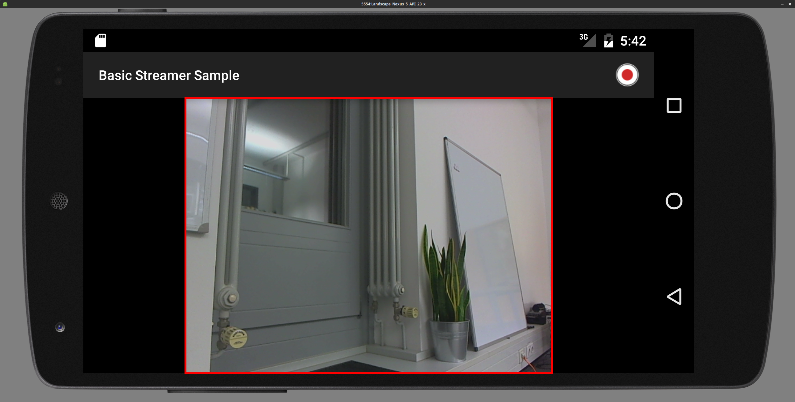

# Android nanoStream SDK

## Resolution, Aspect Ratio and Orientation

### Resolution
Resolution means the native resolution of the camera (input). In the most situations this will be the same for the output.
To set the resolution there is a function in the `VideoSettings` object called `setResolution(Resolution res)`. If you set a resolution that the
device doesn't support, nanoStream will automatically switch to the nearest resolution available on the device. A list of supported resolutions for the current video source can be obtained from `getCapabilities().listAvailableVideoResolutions()`
on the `nanoStream` object.

### Aspect Ratio
Aspect ratio means the aspect ratio of the outgoing stream. The aspect ratio determines if the input video needs to be cropped.
The aspect ratio can be set through the `setAspectRatio(AspectRatio aspectRatio)` function on the `VideoSettings` object.

#### Supported Aspect Ratios
| Aspect Ratio | AspectRatio value            |
|--------------|------------------------------|
| Keep Input   | AspectRatio.RATIO_KEEP_INPUT |
| 1:1          | AspectRatio.RATIO_1_1        |
| 4:3          | AspectRatio.RATIO_4_3        |
| 16:9         | AspectRatio.RATIO_16_9       |
| 3:4          | AspectRatio.RATIO_3_4        |
| 9:16         | AspectRatio.RATIO_9_16       |


### Orientation
The default stream orientation is landscape. If you switch to portrait the resolution will swap width and height, e.g. from 640x480 to 480x640.
You can set the stream orientation on the `nanoStream` object with the `setStreamRotation` function. The stream orientation needs to be set
before starting the stream, it is not possible to switch the orientation during the stream.

#### Supported Orientations

| Orientation           | Rotation Value        |
|-----------------------|-----------------------|
| Landscape             | Rotation.ROTATION_0   |
| Portrait              | Rotation.ROTATION_90  |
| Landscape Upside Down | Rotation.ROTATION_180 |
| Portrait Upside Down  | Rotation.ROTATION_270 |


### Example Combinations of Aspect Ratios and Orientations  
The input resolution is set to 640x480 here.
The red rectangle marks up the active area that is included in the output stream.

| Orientation                    | Aspect Ratio | Stream Area                                 |
|--------------------------------|--------------|---------------------------------------------|
| Portrait<sup>[1](#fnAS1)</sup> | Keep Input   |   |
| Portrait<sup>[1](#fnAS1)</sup> | 4:3          |          |
| Portrait<sup>[1](#fnAS1)</sup> | 3:4          |          |
| Portrait<sup>[1](#fnAS1)</sup> | 16:9         |         |
| Portrait<sup>[1](#fnAS1)</sup> | 9:16         |         |
| Landscape                      | Keep Input   |  |
| Landscape                      | 4:3          |         |
| Landscape                      | 3:4          |         |
| Landscape                      | 16:9         |        |
| Landscape                      | 9:16         |        |

<a name="fnAS1">1</a>: In this sample APP we crop the preview so it doesn't look ugly, so the stream is actually larger then the preview.

### Example
If you want to stream with a resolution of 640x360 but your device doesn't supports this resolution, you need to crop the resolution from 640x480 (this resolution is supported by the most devices) to 640x360.
This can be done through the aspect ratio, so you need to set the aspect ratio to 16:9 to stream with a resolution of 640x360.

### <a name="aspect_ratio_implementation_example">Implementation Example</a>

```java
public class MainActivity {
    ...
    @Override
    protected void onCreate(Bundle savedInstanceState) {
      super.onCreate(savedInstanceState);
      nanoStreamSettings nss = new nanoStreamSettings();
      VideoSettings vs = new VideoSettings();
      ...
      vs.setResolution(new Resolution(640, 480)); // default value
      vs.setAspectRatio(AspectRatio.RATIO_16_9); // default value is AspectRatio.KEEP_INPUT
      ...
      streamLib = new nanoStream(nss);
      streaLib.init();

      streamLib.setStreamRotation(Rotation.ROTATION_0); // default value
      ...
    }
    ...
}
```

## Camera Zoom

### <a name="zoom_description">Description</a>

The nanoStream Android SDK supports camera zoom, if the internal camera supports it.
Therefor there are a few functions, the most important are:

| Function          | Return Type     | returns                                                                   |
|-------------------|-----------------|---------------------------------------------------------------------------|
| `hasZoom()`       | `booelan`       | true if zoom is supported by the video source / device                    |
| `getZoomRatios()` | `List<Integer>` | list with of ale zoom ratios                                              |
| `getZoom()`       | `int`           | the index of the `List<Integer>` that returned from `getZommRatios()`     |
| `setZoom(int)`    | `int`           | the new index of the `List<Integer>` that returned from `getZommRatios()` |

It is recommended to use `pinch to zoom`, therefor you need to implement a `ScaleGestureDetector.SimpleOnScaleGestureListener`,
and a `pinch2zoom` function, that takes the `scalefactor` from the `SimpleOnScaleGestureListener` as a int parameter, take a look at the [Implementation Example](#zoom_implementation_example).

#### getZoomRatios()
`getZoomRatios()` returns a List of Integer values, this values are the zoom ratios in 1/100 increments (e.g. a zoom of 3.2x is returned as 320).

#### setZoom(int)
The int parameter from `setZoom(int zoom)` is the index of zoom ratios that returns `getZoomRatios()`.

### Zoom Behavior on Camera Switch
During a camera switch (e.g. from back to front) the zoom remains unaffected.

### <a name="zoom_implementation_example">Implementation Example</a>

```java
public class MainActivity extends Activity {
  private ScaleGestureDetector scaleGestureDetector;
  private List<Integer> mZoomRatios = null;

  private nanoStream streamLib = null;

  @Override
  protected void onCreate(Bundle savedInstanceState) {
    super.onCreate(savedInstanceState);

    nanoStreamSettings nss = new nanoStreamSettings();
    // configure nanoStreamSettings

    streamLib = new nanoStream(nss);

    if(streamLib.hasZoom()) {
      mZoomRatios = streamLib.getZoomRatio();
    }

    if(null == scaleGestureDetector) {
      scaleGestureDetector = new ScaleGestureDetector(this, new ScaleGestureListener());
    }
  }

  @Override
  public boolean onTouchEvent(MotionEvent event)
  {
    if (scaleGestureDetector != null)
    {
      scaleGestureDetector.onTouchEvent(event);
    }
    return true;
  }

  private class ScaleGestureListener extends ScaleGestureDetector.SimpleOnScaleGestureListener {
    @Override
    public boolean onScale(ScaleGestureDetector detector) {
      if(null != streamLib) {
        if (streamLib.hasZoom()) {
          pinch2Zoom(detector.getScaleFactor());
        }
      }
      return true;
    }
  }

  public void pinch2Zoom(float scaleFactor) {
    if (streamLib.hasZoom() && null != mZoomRatios) {
      int zoomFactor = streamLib.getZoom();
      float zoomRatio = mZoomRatios.get(zoomFactor) / 100f;
      zoomRatio *= scaleFactor;
      if (zoomRatio > 1.0f) {
        if (scaleFactor > 1.0f) {
          for (int i = zoomFactor; i < mZoomRatios.size(); i++) {
            Double zoom = mZoomRatios.get(i) / 100.0;
            if (zoom >= zoomRatio) {
              streamLib.setZoom(i);
              break;
            }
          }
        } else {
          for (int i = zoomFactor; i > 0; i--) {
            Double zoom = mZoomRatios.get(i) / 100.0;
            if (zoom <= zoomRatio) {
              streamLib.setZoom(i);
              break;
            }
          }
        }
      }
    }
  }   
}
```
## Camera Focus

### <a name="focus_description">Description</a>

The nanoStream Android SDK supports camera focus and focus lock, if the internal cameras supports them.
There are two non-blocking functions
```java
setFocusArea(int focusWidth, int focusHeight, float areaMultiple, int x, int y, int previewWidth, int previewHeight, int weigh)
setFocusLockArea(int focusWidth, int focusHeight, float areaMultiple, int x, int y, int previewWidth, int previewHeight, int weigh)
```
through the
```java
addFocusCalback(FocusCallback callback)
removeFocusCalback(FocusCallback callback)
```
you can attach or remove a FocusCallback listener.
To check if your device supports focus call the function
```java
isFocusSupported()
```
which will return true or false.

### <<a name="focus_parameter_list">Parameter List</a>

| Parameter name | meaning                                             |
|----------------|-----------------------------------------------------|
| focusWidth     | the focus Area width                                |
| focusHeight    | the focus Area height                               |
| areaMultiple   | a Multiple for the focus area (default: 1f)         |
| x              | the x position on the Screen                        |
| y              | the y position on the Screen                        |
| previewWidth   | the width of the preview                            |
| previewHeight  | the height of the preview                           |
| weight         | the weight of the area must be range from 1 to 1000 |

### FocusCallback interface
The FocusCallback interface has three abstract functions
```java
onSuccess()
onSuccess(Rect rect, Boolean focusLock)
onFailure()
```

### <a name="focus_implementation_example">Implementation Example</a>

```java
public class MainActifity extens Actifity implements FocusCallback {
  private GestureDetector gestureDetector;
  private nanoStream streamLib = null;

  @Override
  protected void onCreate(Bundle savedInstanceState) {
    super.onCreate(savedInstanceState);
    streamLib = new nanoStream(new nanoStreamSettings());
    if(streamLib.isFocusSupported()) {
      gestureDetector = new GestureDetector(this, new GestureListener());
    }
    ...
  }

  @Override
  public boolean onTouchEvent(MotionEvent event)
  {
    if (gestureDetector != null)
    {
        gestureDetector.onTouchEvent(event);
    }
    return true;
  }
  ....
  private class GestureListener implements OnGestureListener {

     @Override
     public boolean onSingleTapUp(MotionEvent e)
     {
         if (streamLib != null)
         {
             streamLib.setFocusArea(300, 300, 1f, (int) e.getX(), (int) e.getY(), surface.getWidth(), surface.getHeight(), 1000);
         }
         return true;
     }

    @Override
     public void onLongPress(MotionEvent e)
     {
         if (streamLib != null)
         {
             streamLib.setFocusLockArea(300, 300, 1f, (int) e.getX(), (int) e.getY(), surface.getWidth(), surface.getHeight(), 1000);
         }
     }
   }

   @Override
    public void onSuccess(Rect rect, Boolean aBoolean) {
      Log.i(TAG, "focus success");
    }

    @Override
    public void onFailure() {
      Log.i(TAG, "focus failed");
    }
}
```

## DeviceProperties
Before Android 4.3 there was no obligation for Android hardware manufacturers to pass the video related parts of the CTS (Compatibility Test Suite).
Therefore some Android 4.1 and 4.2 Devices show non standard behaviour in regard to color format definitions and representation of video frames in memory. This could lead to issues in the video stream like switched red and blue colors, dislocated color components or a green bar at the bottom of the video frame. nanoStream Android now provides the functionality to detect and compensate common issues related to this.

### <a name="device_properies_description">Description</a>
`nanoStream.getDeviceProperties()` is a static function that is running a test on the device hardware to detect non standard behaviour and returning a DeviceProperties object containing the result.
`DeviceProperties.getFlags()` returns the test result as an integer value that can be stored in the application preferences, to avoid running the device test on every app start.
DeviceProperties can be applied to a new nanoStream instance by calling `nanoStream.setDeviceProperties(DeviceProperties)`.
We recommend to call `getDeviceProperties()` in a background thread during the first app start on a pre 4.3 device, because the call is blocking and might last up to 5 seconds on older/weaker devices.
We also recommend to store the OS version in the preferences, to be able to detect OS updates and to eventually rerun the device test or stop setting the DeviceProperties if the new OS is 4.3 or higher.

### <a name="device_properties_implementation_example">Implementation Example</a>
```java
public class App extends Application
{
    private static DeviceProperties deviceProp = null;

    public void onCreate()
    {
        super.onCreate();

        Thread chkThread = new Thread(new Runnable()
        {
            @Override
            public void run()
            {
                try
                {
                    SharedPreferences prefs = PreferenceManager.getDefaultSharedPreferences(getApplicationContext());
                    int curApiVer = android.os.Build.VERSION.SDK_INT;
                    int curAppVer = getPackageManager().getPackageInfo(getPackageName(), 0).versionCode;
                    int curEncVer = DeviceProperties.VERSION;

                    int oldApiVer = prefs.getInt("Pref_Android_API", 0);
                    int oldAppVer = prefs.getInt("Pref_App_Version", 0);
                    int oldChkVer = prefs.getInt("Pref_Check_Version", 0);
                    int oldChkResult = prefs.getInt("Pref_Check_Result", -1);

                    if (((oldApiVer * oldAppVer * oldApiVer) == 0)
                    || (oldApiVer < curApiVer)
                    || (oldAppVer < curAppVer)
                    || (oldChkVer < curEncVer)
                    || oldChkResult < 0)
                    {

                        Editor edit = prefs.edit();
                        edit.putInt("Pref_Android_API", curApiVer);
                        edit.putInt("Pref_App_Version", curAppVer);

                        /* Run  device check */
                        try
                        {
                            deviceProp = nanoStream.getDeviceProperties();

                            edit.putInt("Pref_Check_Result", deviceProp.getFlags());
                            edit.putInt("Pref_Check_Version", deviceProp.getVersion());
                            edit.commit();
                        }
                        catch (RuntimeException e)
                        {
                            Log.d("Device Check failed", e.toString());
                            edit.putInt("Pref_Check_Result", -1);
                            edit.putInt("Pref_Check_Version", 0);
                            edit.commit();
                        }

                    }
                    else
                    {
                        deviceProp = new DeviceProperties(oldChkResult);
                    }

                    Log.d("Device Properties: ", deviceProp.toString());
                }
                catch (Exception e)
                {
                    Log.d(this.getClass().getName(), "Device Check Runnable");
                    e.printStackTrace();
                }
            }
        });

        if (android.os.Build.VERSION.SDK_INT < 18)
        {
            chkThread.start();
        }

        ...
    }

    public static DeviceProperties getDeviceProperties()
    {
        return deviceProp;
    }
}
```

```java
public class MainActivity extends Activity implements NanostreamEventListener
{
    ...
    @Override
    protected void onCreate(Bundle savedInstanceState)
    {
        try
        {
            nanoStreamSettings nss = new nanoStreamSettings();

            streamLib = new nanoStream(nss);

            DeviceProperties deviceProperties = App.getDeviceProperties();

            if(null != streamLib && null != deviceProperties)
            {
                streamLib.setDeviceProperties(deviceProperties);
            }
        }
        catch(NanostreamException en)
        {
            Toast.makeText(getApplicationContext(), en.toString(), Toast.LENGTH_LONG).show();
        }
    }
    ...
}
}
```

## RTMP Playback
### <a name="rtmp_playback_description">Description</a>
RTMP Playback Component enables application developers to add playback of RTMP live and on demand streams to their apps.

Supported codecs are H.264 Video, AAC and MP3 Audio.

Video streams are decoded and rendered on a Surface that is hold by the application, usually connected to a `SurfaceView`.

Audio streams are decoded and rendered to system audio using the Android AudioSession/AudioTrack API.

The interface and usage are similar to the Android MediaPlayer. The Android MediaPlayerControl interface is implemented to enable control through an `android.widget.MediaController` instance.

### Requirements

Related nanoStream SDK Version: 4.1

Minimum supported Android OS/API: 4.1/API 16

Required application permissions:
- `android.permission.INTERNET`
- `android.permission.RECORD_AUDIO`
- `android.permission.RECORD_VIDEO`
- `android.permission.MODIFY_AUDIO_SETTINGS`

### License
The playback component requires a special feature flag to be enabled in your nanoStream license key. It not necessarily included in nanoStream Android SDK licenses.

### <a name="rtmp_playback_interface">Interface</a>
#### Package name
`net.nanocosmos.nanoStream.streamer`
#### Declaration
`public abstract class NanostreamPlayer implements MediaPlayercontrol, Surfaceholder.Callback`
#### Function Life Cycle
| Instance Handling      | Initialization         | Capabilities    | Queries            | Playback Control | Supported by RTMP Player |
|------------------------|------------------------|-----------------|--------------------|------------------|--------------------------|
| createNanostreamPlayer |                        |                 |                    |                  |                          |
|                        | setSettings            |                 |                    |                  | yes                      |
|                        | setPlayerEventListener |                 |                    |                  | yes                      |
|                        |                        | canPrepare      |                    |                  | yes                      |
|                        |                        | canPrepareAsync |                    |                  | yes                      |
|                        |                        | canPause        |                    |                  | yes                      |
|                        |                        | canSeekBackward |                    |                  | yes                      |
|                        |                        | canSeekForward  |                    |                  | yes                      |
|                        |                        |                 | getState           |                  | yes                      |
|                        |                        |                 | isPlaying          |                  | yes                      |
|                        |                        |                 | getCurrentPosition |                  | no                       |
|                        |                        |                 | getDuration        |                  | no                       |
|                        |                        |                 |                    | prepare          | no                       |
|                        |                        |                 |                    | prepareAsync     | no                       |
|                        |                        |                 |                    | start            | yes                      |
|                        |                        |                 |                    | pause            | yes                      |
|                        |                        |                 |                    | seekTo           | yes                      |
|                        |                        |                 |                    | stop             | yes                      |
|                        |                        |                 |                    | start            | yes                      |
|                        |                        |                 |                    | stop             | yes                      |
|                        | close                  |                 |                    |                  | no                       |
|                        | release                |                 |                    |                  | yes                      |

### Creating an Instance
`NanostreamPlayer` instances can be created through the static factory function `createNanostreamPlayer` at the top level `nanoStream class`. NanostreamPlayer is designed to support multiple player instances. The number of parallel instances can be limited by system resources such as codec,surfaces,memory, network connections and bandwidth.
### Configuration and Settings
Initial player settings are wrapped by the `NanostreamPlayer.PlayerSettings` class. The settings can be applied by calling `NanostreamPlayer.setSettings`.

### PlayerSettings:

| Setting             | Functions                                                           | Description                                                                  | Type              | Default Values         |
|---------------------|---------------------------------------------------------------------|------------------------------------------------------------------------------|-------------------|------------------------|
| License             | getLicense/setLicense                                               | nanoStream license key                                                       | String            | empty                  |
| Url                 | getUrl/setUrl                                                       | RTMP url                                                                     | String            | empty                  |
| Stream Name         | getStreamname/setStreamname                                         | RTMP stream name                                                             | String            | empty                  |
| User Name           | getUsername/setUsername                                             | User name if RTMP authentication is required                                 | String            | empty                  |
| Password            | getPassword/setPassword	Password if RTMP authentication is required | String                                                                       | empty             |                        |
| Buffer Time         | getBufferTimeMs/setBufferTimeMs                                     | Length of the stream buffer in milliseconds                                  | Integer           | 2000ms/2s              |
| Frame Dropping Mode | getFrameDroppingMode/setFrameDroppingMode                           | Configuration of the dropping mode regarding different droppable frame types | FrameDroppingMode | DROP_NO_FRAMES         |
| Stream Playback     | getVideoPlayback/getAudioPlayback/setStreamPlayback                 | Enable stream types to be decoded and played                                 | boolean           | video:true, audio:true |
| TrackTimout         | getTrackTimeout/setTrackTimeout                                     | Timeout to waiting for Track info                                            | long              | 10000                  |
| EndlessMode         | getEndlessMode/setEndlessMode                                       | Reopen the stream until stop call                                            | boolean           | false                  |

### Player State
The player stat can be queried through the `getState()` function
```java
/**
*
* The different states of the player instance.
*
*/
public enum PlayerState
{
    IDLE, INITIALIZED, PREPARED, STARTED, PAUSED, SEEKING, BUFFERING, RECONNECTING, PLAYBACKCOMPLETED, STOPPING, STOPPED;
}
```

| State                         | Description                                                            | Supported by RTMP Player |
|-------------------------------|------------------------------------------------------------------------|--------------------------|
| PlayerState.IDLE              | Initial state. Player has not yet been initialized or has been closed. | yes                      |
| PlayerState.INITIALIZED       | Player has been initialized with license and settings.                 | yes                      |
| PlayerState.PREPARED          | Player has been prepared and is ready to start.                        | no                       |
| PlayerState.STARTED           | Playback has been started.                                             | yes                      |
| PlayerState.PAUSED            | Playback has been paused.                                              | yes                      |
| PlayerState.SEEKING           | Player is Seeking                                                      | yes                      |
| PlayerState.BUFFERING         | Player is buffering stream data.                                       | yes                      |
| PlayerState.RECONNECTING      | Player is performing a reconnect                                       | no                       |
| PlayerState.PLAYBACKCOMPLETED | Playback has ended due to end of stream.                               | yes                      |
| PlayerState.STOPPING          | Player is stopping                                                     | yes                      |
| PlayerState.STOPPED           | Player is stopped                                                      | yes                      |

### Event Notification
Event notifications can be received through the `NanostreamPlayer.PlayerEventListener` interface. Derive your listener from this interface and add it to the player by calling `setPlayerEventListener()`.

### Status Events
Event Type : `TYPE_RTMP_STATUS`

| Event Code                                         | Description                                      | Corresponding State           |
|----------------------------------------------------|--------------------------------------------------|-------------------------------|
| NanostreamEvent.CODE_STREAM_STARTED                | Playback has been started.                       | PlayerState.STARTED           |
| NanostreamEvent.CODE_STREAM_STOPPING               | Playback will stop.                              | PlayerState.STOPPING          |
| NanostreamEvent.CODE_STREAM_STOPPED                | Playback has been stopped.                       | PlayerState.STOPPED           |
| NanostreamEvent.CODE_STREAM_ERROR_CONNECT          | The connect to the stream url failed.            | PlayerState.STOPPED           |
| NanostreamEvent.CODE_STREAM_BUFFERING              | Player is buffering stream data                  | PlayerState.BUFFERING         |
| NanostreamEvent.CODE_STREAM_PLAYBACKCOMPLETED      | Playback has ended due to end of stream.         | PlayerState.PLAYBACKCOMPLETED |
| NanostreamEvent.CODE_STREAM_NOT_FOUND              | The specified stream could not be found.         | PlayerState.STOPPED           |
| NanostreamEvent.CODE_STREAM_SEEKING                | The Stream is seeking.                           | PlayerState.SEEKING           |
| NanostreamEvent.CODE_STREAM_PAUSED                 | The Stream is paused                             | PlayerState.PAUSED            |
| NanostreamEvent.CODE_STREAM_VIDEO_FORMAT_AVAILABLE | The Stream has a MediaFormat for the Video Track |                               |
| NanostreamEvent.CODE_STREAM_AUDIO_FORMAT_AVAILABLE | The Stream has a MediaFormat for the Audio Track |                               |


### Results and Error Events
Event Type : `TYPENANORESULTS` Event Codes : Values of type nanoResults

| Event Code                                      | Description                                                       | Corresponding State |
|-------------------------------------------------|-------------------------------------------------------------------|---------------------|
| nanoResults.N_NOT_INITIALIZED                   | The RTMP library has not been initialized properly.               | PlayerState.STOPPED |
| nanoResults.N_ALLOCATEDATA_FAILED_RTMP_SRC      | Memory allocation failed.                                         | PlayerState.STOPPED |
| nanoResults.N_LICENSE_INVALID                   | License check failed - License invalid.                           | PlayerState.STOPPED |
| nanoResults.N_LICENSE_INVALID_RTMP_SRC          | License check failed - RTMP playback is not included.             | PlayerState.STOPPED |
| nanoResults.N_LICENSE_EXPIRED                   | License check failed - The license period has ended.              | PlayerState.STOPPED |
| nanoResults.N_TCP_CONNECT_FAILED                | TCP connect failed.                                               | PlayerState.STOPPED |
| nanoResults.N_RTMP_HANDSHAKE_FAILED             | RTMP handshake failed.                                            | PlayerState.STOPPED |
| nanoResults.N_RTMP_CONNECT_FAILED               | RTMP connect failed.                                              | PlayerState.STOPPED |
| nanoResults.N_RTMP_AUTH_FAILED                  | RTMP authentication is required and failed.                       | PlayerState.STOPPED |
| nanoResults.N_RTMP_APP_INVALID                  | The application part of the url is invalid and has been rejected. | PlayerState.STOPPED |
| nanoResults.N_RTMP_STATUS_PLAY_STREAM_NOT_FOUND | The stream name could not be found.                               | PlayerState.STOPPED |
| nanoResults.N_RTMP_STATUS_PLAY_STREAM_SEEK      | The player is seeking.                                            | PlayerState.SEEKING |
| nanoResults.N_RTMP_SEEK_NOT_AVAILABLE           | The stream can not seek.                                          |                     |
| nanoResults.N_RTMP_SEEK_FAILED                  | The stream can not seek.                                          |                     |

### Audio / Video Format
After the `NanostreamEvent.CODE_STREAM_AUDIO/VIDEO_FORMAT_AVAILABLE` event, you can get the MediaFormat Object with the `getAudio/VideoFormat()`[^(2)] function call.
We added two custom Fields for the Video MediaFormat:
&nbsp; &nbsp; `NanostreamPlayer.KEY_ASPECT_RATIO_WIDTH`
&nbsp; &nbsp; `NanostreamPlayer.KEY_ASPECT_RATIO_HEIGHT`
With these custom fields you can get the aspect ratio width and height.

```java
MediaFormat videoFormat = mPlayer.getVideoFormat();

int aspectRatioWidth = videoFormat.getInteger(NanostreamPlayer.KEY_ASPECT_RATIO_WIDTH);
int aspectRatioHeight = videoFormat.getInteger(NanostreamPlayer.KEY_ASPECT_RATIO_HEIGHT);
```

### <a name="rtmp_playback_implementation_example">Implementation Example</a>

```java
public class PlayerActivity extends Activity implements PlayerEventListener, SurfaceHolder.Callback {
    ...
    private NanostreamPlayer mPlayer = null;
    private String license = "YOUR LICENSE CODE";

    private String strStreamUrl = "rtmp://192.168.1.100/vod";
    private String strStreamname = "mp4:file.mp4";

    private LinearLayout root;

    @Override
    protected void onCreate(Bundle savedInstanceState) {
        super.onCreate(savedInstanceState);
        root = new LinearLayout(this);
        root.setOrientation(LinearLayout.VERTICAL);
        root.setLayoutParams(containerParams);
        root.setBackgroundColor(Color.BLACK);

        ...

        mPlayer = nanoStream.createNanostreamPlayer();

        PlayerSettings settings = mPlayer.new PlayerSettings();

        settings.setLicense(license);
        settings.setUrl(strStreamUrl);
        settings.setStreamname(strStreamname);
        settings.setAuthUsername("");
        settings.setAuthPassword("");
        settings.setBufferTimeMs(2000);

        mPlayer.setSettings(settings);
        mPlayer.setPlayerEventListener(this);

        ...
        // we need a surface Callback for the application
        LinearLayout.LayoutParams surfaceParams = new LinearLayout.LayoutParams(ViewGroup.LayoutParams.FILL_PARENT, ViewGroup.LayoutParams.FILL_PARENT, 0.5F);
        surfaceParams.gravity = Gravity.CENTER;
        surfaceParams.weight = 0.5f;

        SurfaceView surfaceView = new SurfaceView(this);
        surfaceView.setLayoutParams(surfaceParams);
        surfaceView.getHolder.addCallback(this);

        root.addView(surfaceView);
        setContentView(root);
    }

    ...

    @Override
    public void onPlayerEvent(NanostreamEvent event, NanostreamPlayer instance) {
        final String msg = event.GetDescription();
        Log.d(this.getClass().getName(), event.GetDescription());
    }

    @Override
    public void surfaceCreated(SurfaceHolder holder) {
        mPlayer.surfaceCreated(holder);

        try {
            if (!mPlayer.getState().equals(PlayerState.STARTED)) {
                mPlayer.start();
            }
        } catch (IllegalStateException e) {
            e.printStackTrace();
        }
    }

    @Override
    public void surfaceChanged(SurfaceHolder holder, int format, int width, int height) {
        mPlayer.surfaceChanged(holder, format, width, height);
    }

    @Override
    public void surfaceDestroyed(SurfaceHolder holder) {
        mPlayer.surfaceDestroyed(holder);
    }
}
```

## MP4 Local Recording

### <a name="mp4_description">Description</a>

The nanoStream Android SDK supports local file recording on the device in MP4 format.
This document describes how to enable and configure nanoStream for local recording.

### Steps to configure MP4 recording

MP4 recording can be configured with two function calls on a nanoStreamSettings object.

1. Enabling MP4 recording: setRecordMp4(boolean)
2. Setting up the file path: setMp4Path(String)

### setRecordMp4(boolean)

The setRecordMp4 function takes a boolean as parameter to enable/disable the recording function.

### setMp4Path(String)

The setMp4Path function takes a String as parameter. This string needs to be a valid file path (e.g. /sdcard/test.mp4).
It is recommended to use the getExternalStorageDirectory or getExternalStoragePublicDirectory functions from the Android [Enviroment][53119650] API, and add a file name to the returned path.
Please find the code snippet below as an example.

### Android Permission

To be able to write to an external file path your Android app needs the following permissions to be added to the
app manifest (AndroidMainfest.xml).

```xml
<uses-permission android:name="android.permission.WRITE_EXTERNAL_STORAGE" />
<uses-permission android:name="android.permission.STORAGE" />
```

#### <a name="mp4_android_6">Android 6.0</a>

Due to the new permission handling in Android 6 (M) writing to external directories (DCIM) requires a permission by user.
Writing to the applications own data directory (/Android/data/com.companyname.appname/) is not restricted.

### <a name="mp4_implementation_example">Implementation Example</a>

```java
File externalFilePath = Environment.getExternalStoragePublicDirectory(Environment.DIRECTORY_DCIM);
File filePath = new File(externalFilePath, "myMp4File.mp4");
String mp4FilePath = filePath.getAbsolutePath();

nanoStreamSettings nss = new nanoStreamSettings();
nss.setRecordMp4(true);
nss.setMp4Path(mp4FilePath);
```

## Further questions? Would you like a feature not available yet?
We can make it work for you based on our consulting and development / implementation services. [Contact us][dddca5bd]


[//]: # (Link list)
[53119650]: https://developer.android.com/reference/android/os/Environment.html "Android Enviroment"
[dddca5bd]: http://www.nanocosmos.de/v4/en/contact-form.html "Contect us"
