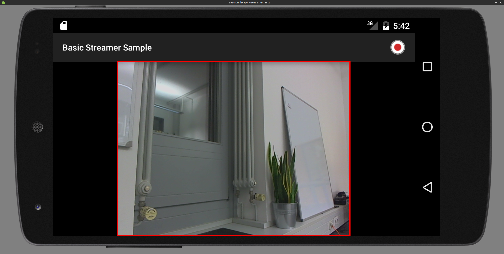

# Resolution, Aspect Ratio and Orientation
## Resolution

Resolution means the native resolution of the camera (input). In the most situations this will be the same for the output. To set the resolution there is a function in the VideoSettings object called setResolution(Resolution res). If you set a resolution that the device doesn't support, nanoStream will automatically switch to the nearest resolution available on the device. A list of supported resolutions for the current video source can be obtained from getCapabilities().listAvailableVideoResolutions() on the nanoStream object.

## Aspect ratio

Aspect ratio means the aspect ratio of the outgoing stream. The aspect ratio determines if the input video needs to be cropped. The aspect ratio can be set through the setAspectRatio(AspectRatio aspectRatio) function on the VideoSettings object.
### Supported Aspect ratios
| Aspect Ratio | AspectRatio value          |
|:-------------|:---------------------------|
| Keep Input   | AspectRatio.RATIOKEEPINPUT |
| 1:1          | AspectRatio.RATIO11        |
| 4:3          | AspectRatio.RATIO43        |
| 16:9         | AspectRatio.RATIO169       |
| 3:4          | AspectRatio.RATIO34        |
| 9:16         | AspectRatio.RATIO_9_16     |
## Orientation
The default stream orientation is landscape. If you switch to portrait the resolution will swap width and height, e.g. from 640×480 to 480×640. You can set the stream orientation on the nanoStream object with the setStreamRotation function. The stream orientation needs to be set before starting the stream, it is not possible to switch the orientation during the

### Supported Orientations

| Orientation           | Rotation Value        |
|-----------------------|-----------------------|
| Landscape             | Rotation.ROTATION_0   |
| Portrait              | Rotation.ROTATION_90  |
| Landscape Upside Down | Rotation.ROTATION_180 |
| Portrait Upside Down  | Rotation.ROTATION_270 |

## Example Combinations of Aspect Ratios and Orientations

The input resolution is set to 640x480 here. The red rectangle marks up the active area that is included in the output stream.

| Orientation                    | Aspect Ratio | Stream Area                                 |
|--------------------------------|--------------|---------------------------------------------|
| Portrait<sup>[1](#fnAS1)</sup> | Keep Input   |   |
| Portrait<sup>[1](#fnAS1)</sup> | 4:3          |          |
| Portrait<sup>[1](#fnAS1)</sup> | 3:4          |          |
| Portrait<sup>[1](#fnAS1)</sup> | 16:9         |         |
| Portrait<sup>[1](#fnAS1)</sup> | 9:16         |         |
| Landscape                      | Keep Input   |  |
| Landscape                      | 4:3          |         |
| Landscape                      | 3:4          |         |
| Landscape                      | 16:9         |        |
| Landscape                      | 9:16         |        |

<a name="fnAS1">1</a>: In this sample APP we crop the preview so it doesn't look ugly, so the stream is actually larger then the preview.


### Example

If you want to stream with a resolution of 640x360 but your device doesn't supports this resolution, you need to crop the resolution from 640x480 (this resolution is supported by the most devices) to 640x360. This can be done through the aspect ratio, so you need to set the aspect ratio to 16:9 to stream with a resolution of 640x360.

### Implementation Example

```java
public class MainActifity {
    ...
    @Override
    protected void onCreate(Bundle savedInstanceState) {
      super.onCreate(savedInstanceState);
      nanoStreamSettings nss = new nanoStreamSettings();
      VideoSettings vs = new VideoSettings();
      ...
      vs.setResolution(new Resolution(640, 480)); // default value
      vs.setAspectRatio(AspectRatio.RATIO_16_9); // default value is AspectRatio.KEEP_INPUT
      ...
      streamLib = new nanoStream(nss);
      streaLib.init();

      streamLib.setStreamRotation(Rotation.ROTATION_0); // default value
      ...
    }
    ...
}
```
