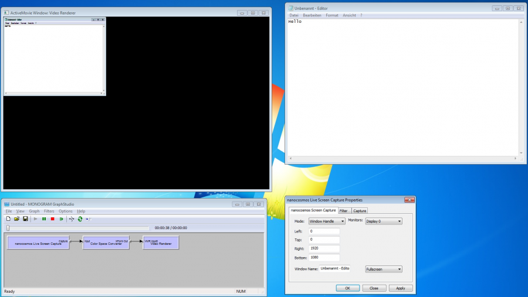

## How to use the Screen Capture DirectShow filter

### Capture Modes
  * Mouse Follow
  * Region
  * Screen
  * Window Handle

### Screen Capture - Single Window

It is possible to capture a single window instead of the entire screen. The content of the window is captured even if the window is partially or completely in the background. You need to enter the Window handle or Window class name into the field.

At the moment there are two modes for capturing a single window:
  * Auto Size: adjusts the output size depending on the size of the window to capture, before the directshow graph is started

   
  * Fullscreen: the output size is equivalent to the screen size, the window size is not scaled, the window can be resized while the graph is running and one can see the whole window at all times

  

  * Scaling example: if you need to downscale a full screen capture, use the additional "Resize/Scale" functionality in the encoder or add a resizer/scaler filter to the DirectShow filter graph

### Region Capture

If the output of the region area seems to be different from the specified region, check if Windows display zoom is enabled:

