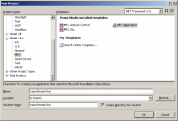
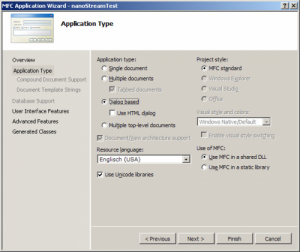
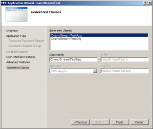
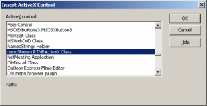
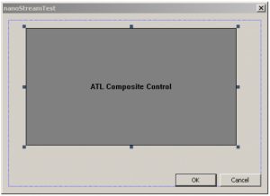
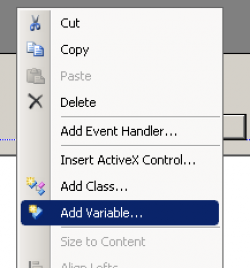
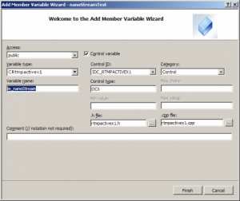
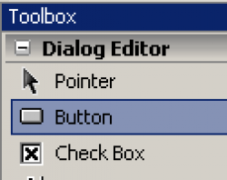
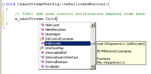

This tutorial shows how to create a custom Live Encoding and Streaming application with the nanoStream plugins, based on VisualStudio, C++ and MFC.
This tutorial was created with VisualStudio 2008 but should work similar with VS 2010.
Create a new MFC Application Project (File/New Project)

&nbsp;

In the following MFC Application Wizard, select “Dialog Based Application”

Select all default values for the rest and Finish

&nbsp;

A new project solution is created based on an empty dialog.

Right-click on the dialog and select “Insert ActiveX Control…”

&nbsp;

Select “nanoStream RTMPActiveX Class”

&nbsp;

Position and resize the control window accordingly.

The window will show a live camera preview later.

&nbsp;

Create a class member variable for the control for simpler access:

Now let us create a button to create a camera preview.

From the Toolbox, select “Button” and place the button on the dialog.

&nbsp;

Double-Click on the button to edit the new source code event handler:

&nbsp;

This is the complete code which shows the camera preview:
<pre class="lang:c++ decode:true">void CnanoStreamTestDlg::OnBnClickedButton1()
{
//nanoStream Live Video Encoder Plugin
m_nanoStream.InitEncoder(); // Init Encoder
m_nanoStream.put_VideoSource(0); // Select Video Capture Source
m_nanoStream.StartPreview(); // Start Camera Preview in Window
}</pre>
&nbsp;

Now add another button to start a real encoded stream.
Add the following code to the button:
<pre class="lang:c++ decode:true ">void CnanoStreamTestDlg::OnBnClickedButton2()
{
// nanoStream Live Video Encoder Plugin
// Live Encoding/Streaming to RTMP Server
m_nanoStream.put_License(_T("nlic:1.0:nanoLiveEncDemo:1.1:LivePlgDemo=1,MP4=1,RTMP=1,....."));
m_nanoStream.InitEncoder(); // Init Encoder
m_nanoStream.put_VideoSource(0); // Select Video Capture Source
m_nanoStream.put_VideoBitrate(500000); // 500 kBit/s encoded bitrate

// URL to Flash Media Server / Wowza Media Server
// Syntax: rtmp://&lt;server&gt;/&lt;app&gt;+&lt;stream&gt;
m_nanoStream.put_DestinationURL(_T("rtmp://ws1.3p0.de/live+mfcStream01"));
m_nanoStream.StartBroadcast(); // Start Camera Preview in Window
}</pre>
When pressing button2 / broadcast, the live encoding will be started.
